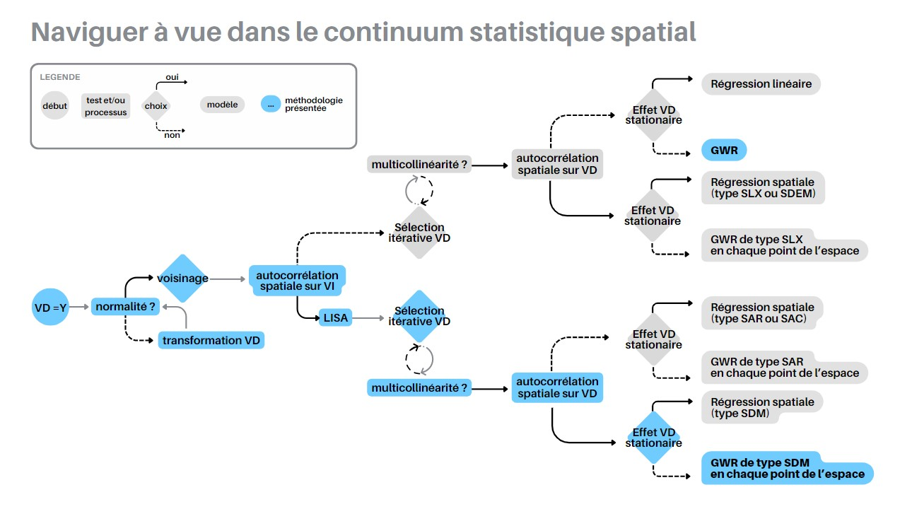

```{r setup, include=FALSE, eval=FALSE}

## Global options
knitr::opts_chunk$set(echo=TRUE,
                      # eval = FALSE,
        	            cache=FALSE,
                      prompt=FALSE,
                      comment=NA,
                      message=FALSE,
                      warning=FALSE,
                      class.source="bg-info",
                      class.output="bg-warning")

library(rzine)
```


<div style="background-color: #dcdcdc ; border-color:navajowhite3; padding: 1em; font-size:115% ; color: CCCCCC">
Cette fiche présente la réalisation d'une analyse de données à l'aide de la **régression géographique pondérée ou GWR** (Geographical Weighted Regression). La modélisation statistique dite “classique” présente des risques élevés lorsqu'on souhaite traiter des données spatiales. Des phénomènes de dépendance spatiale, des problèmes d'échelles d'application, des effets de contexte, ainsi qu'une forme d'hétérogénéité spatiale peuvent apparaître et compromettre les analyses effectuées, et engendrer des interprétations tronquées voire inexactes. Souvent ignorées, ces dimensions spatiales ne peuvent pas être considérées comme un simple aléa.

**L'objectif de cette fiche est de vous présenter des méthodes et leurs applications qui vous permettront d'étudier concrètement les effets des dimensions spatiales des données.** Il s'agira de pouvoir d'une part caractériser la structure spatiale de données attributaires liées à des entités spatiales ; et d'autre part de mesurer l'effet statistique de l'information spatiale dans un modèle de régression visant à déterminer les facteurs explicatifs d'un phénomène.

L'analyse présentée ici a pour objectif d'être reproductible : les données spatiales utilisées proviennent de la base ADMIN-EPXRESS de l'Institut national de l'information géographique et forestière (IGN) ; les données statistiques, quant à elles, ont été construites à partir de la base des notaires de France, complétées par des données de l'Institut National de la Statistique et des Études Économiques (INSEE) pour les variables explicatives.

Toutes les figures et cartes ont été produites dans le cadre de la rédaction de cette fiche, sauf mention contraire.
</div>
<br>

<div style="background-color: #dcdcdc ; border-color:navajowhite3; padding: 0.8em; font-size:115% ; color: CCCCCC">
**Prérequis** : connaissances de base en analyse de données statistiques, avec au moins une compréhension de ce qu'est une corrélation et une régression.
</div>


# Pourquoi la GWR ? {-}

Lorsque l'on souhaite dépasser la simple caractérisation d'attributs liés à des individus statistiques, on fait appel à des méthodes de modélisation explicitant des relations statistiques. La méthode la plus employée, principalement en sciences sociales, pour mesurer et analyser la nature des relations et des effets entre deux ou plusieurs variables, est le modèle de **régression linéaire**.

Le principe de la régression linéaire est de modéliser la variable que nous souhaitons étudier (aussi appelée variable dépendante, VD) comme une fonction linéaire des variables que nous aurons définies comme explicatives de la VD (aussi appelées variables indépendantes, VI). Lorsque l'on s'intéresse à un phénomène social observé sur une maille territoriale, la régression linéaire pose plusieurs problèmes :

Le premier est empirique. La régression linéaire nous permet d'obtenir des coefficients (appelés betas **β**) et des résidus (notés epsilon **ε**). Ces **β** représentent l'effet des VI sur la VD. Ces **β** sont considérés comme globaux, sans variation. Autrement dit, les modèles de régression linéaire considèrent que les VI interviennent de la même manière et avec la même importance sur l'ensemble de notre jeu de données. Si cette hypothèse peut être validée sur des populations statistiques définies aléatoirement et sans effet de structure *a priori* des VI ou de la VD, elle n'est que rarement vérifiée sur des données spatiales. En effet, les caractéristiques propres de chaque territoire (l'unicité de chaque lieu) impliquent que l'effet constaté en un lieu n'est pas forcément valable en un autre lieu de l'espace.

Les données sont ainsi structurées :

- Par des relations de proximité : Il s'agit d'un effet de situation induit par la position relative des lieux les uns par rapport aux autres
- Par des hétérogénéités propres aux lieux qui proviennent de caractéristiques géographiques diverses. Ces caractéristiques relèvent d'un effet de site.

Les individus statistiques, représentés par des unités spatiales ne peuvent pas être envisagés comme indépendants et identiquement distribués.

Concernant les prix des valeurs foncières que nous détaillerons par la suite dans cette fiche, on peut comprendre que la proximité au littoral, très prégnante en certains points de l'espace, ne joue absolument aucun rôle dans d'autres lieux. De même, certaines caractérisations du monde rural n'interviennent plus lorsqu'on se situe dans des milieux fortement urbanisés. Ainsi, les données spatialisées sont soumises à l'hétérogénéité spatiale : l'effet des VI va varier en fonction de l'espace. Un coefficient qui serait global et uniforme pour mesurer un effet paraît plus simple et donc tentant, mais non pertinent en géographie ; sur ce point nous pouvons nous référer à l'article de Brunsdon, Fotheringham et Charlton [@Brundson_1996]. **Ce concept d'hétérogénéité dans l'espace se traduit en statistique par celui de non stationnarité**.

Le deuxième problème est statistique : chaque méthode statistique doit répondre à un certain nombre de conditions de validité. La régression linéaire ne fait pas exception. Trois conditions doivent être validées pour qu'une régression linéaire puisse être effectuée sans que l'interprétation des résultats ne conduise à des raisonnements fallacieux :

- Les individus statistiques doivent être indépendants
- Les résidus doivent suivre une distribution normale
- Il ne peut pas y avoir plus de VI que d'individus statistiques

Si les deux dernières conditions ne trouvent pas de matérialisation spécifique sur des données spatiales, la première quant à elle concrétise un problème récurrent sur les données en géographie. Par leur nature même, les données spatiales ne peuvent pas remplir cette condition fondamentale pour une régression classique. La première loi de la géographie de Tobler : *"everything is related to everything else, but near things are more related than distant things"* en est une traduction tout à fait parlante. 

Le troisième problème est lié aux effets de contexte : on ne peut pas étudier des données spatiales sans considérer que les individus statistiques (les objets spatiaux) appartiennent eux-mêmes à des agrégats qui ont une influence sur la variable à expliquer. Ainsi, certains attributs de l'agrégat vont avoir une influence sur l'entité spatiale de cet agrégat.

Le quatrième problème est lié à la problématique du MAUP (Modifiable Area Unit Problem). Il concerne un problème d'échelle d'application de la régression et peut conduire à des observations erronées. Une corrélation constatée à une échelle peut être uniquement liée à l'agrégation réalisée à cette échelle, mais s'avérer erronée à une échelle plus fine, invalidant de fait la relation entre les phénomènes étudiés [@Mathian_2001]. Certaines agrégations peuvent également varier et cacher des relations entre individus [@Bailey_1995].

La GWR ne répond pas à l'ensemble de ces problèmes mais va nous permettre de résoudre les deux premiers en intégrant la dimension spatiale des données tout en tenant compte de l'hétérogénéité (ou non stationnarité) de leur effet.

# Les packages {-}

Voici les packages que nous utiliserons :

```{r, message=FALSE}

# Chargement, visualisation et manipulation de la données
library(here)
library(DT)
library(dplyr)

# Analyse et représentation statistique
library(car)
library(correlation)
library(corrplot)
library(ggplot2)
library(gtsummary)
library(GGally)
library(plotly)

# Manipulation et représentation de la données spatiales (cartographie)
library(sf)
library(mapsf)
library(rgeoda) #permet en plus de calculer les indices d'auto-corrélation spatiale
library(RColorBrewer)

# Calcul du voisinage et réalisation de la GWR
library(spdep)
library(GWmodel)
```

Vous pouvez vérifier l'installation des différents packages à l'aide des lignes de codes suivantes :

```{r packages_rmd, echo=TRUE, results=FALSE}

#  Packages nécessaires
my_packages <- c("here", 
                 "DT", 
                 "dplyr", 
                 "car", 
                 "correlation", 
                 "corrplot", 
                 "ggplot2", 
                 "gtsummary", 
                 "GGally", 
                 "plotly", 
                 "sf", 
                 "mapsf", 
                 "rgeoda", 
                 "RColorBrewer", 
                 "spdep", 
                 "GWmodel")

# Vérifier si ces packages sont installés
missing_packages <- my_packages[!(my_packages %in% installed.packages()[,"Package"])]

# Installation des packages manquants depuis le CRAN
if(length(missing_packages)) install.packages(missing_packages, 
                                              repos = "http://cran.us.r-project.org")

# Chargement des packages nécessaires
lapply(my_packages, library, character.only = TRUE)

```

# Cheminement {-}

Le schéma ci-dessous (Frédéric Audard, 2024) représente les différents cheminements possibles pour expliquer les variations de Y. Les étapes suivies ici sont représentées en bleu.



# Présentation et préparation des données

Nous avons cherché à traiter ici une variable présentant des caractéristiques spatiales fortes et qui rencontrent les deux problèmes exposés précédemment d'indépendance statistique et de non-stationnarité. Les prix de l'immobilier en France sont effectivement soumis à ces problèmes et peuvent être expliqués, au moins partiellement, par des variables quantitatives issues de données de l'INSEE. Nous avons traité l'information liée au prix de l'immobilier à l'échelle des Etablissements Publics de Coopération Intercommunale (EPCI) pour nous assurer un nombre d'observations suffisant dans chaque entité spatiale.

 - Les données du prix de l'immobilier par EPCI (prix médian au m²) sont issues des ventes observées sur l'année 2018, extraites depuis la [base de données des notaires de France](https://www.immobilier.notaires.fr/fr/prix-immobilier){target="_blank"} par Frédéric Audard et Alice Ferrari. Ce fichier a été simplifié pour ne conserver que les variables d'intérêts parmi une cinquantaine
- Les données statistiques proviennent de l'INSEE (année 2019) : 9 variables ont été choisies pour leur potentialité à expliquer les variations des prix de l'immobilier, concernant [la population](https://www.insee.fr/fr/statistiques/6456153?sommaire=6456166){target="_blank"}, [le logement](https://www.insee.fr/fr/statistiques/6454155?sommaire=6454268){target="_blank"} et [les revenus et niveaux de vie](https://www.insee.fr/fr/statistiques/6036907){target="_blank"}. Elles sont détaillées un peu plus bas.
- Comme indiqué en introduction les données spatiales proviennent de la base [ADMIN-EXPRESS de l'IGN](https://geoservices.ign.fr/adminexpress){target="_blank"} en accès libre. La couche est utilisée est celle des EPCI de la base ADMIN-EXPRESS-COG édition 2021 par territoire pour la France métropolitaine.

Les données statistiques et du prix de l'immobilier ont été regroupées dans un même fichier CSV `donnees_standr.csv`.

Ces données de prix de l'immobilier sont fréquemment transformées (passées au logarithme) pour permettre un meilleur ajustement du modèle. Il s'agit d'un positionnement théorique de recherche. Ici, le choix a été fait de conserver la structure statistique initiale de nos données, sans transformation pour deux raisons :

- Le passage au logarithme amoindrit le poids des valeurs extrêmes fortes. Cette transformation aurait donc pour conséquence de réduire le poids de paris dans la compréhension de la spatialisation des prix de l'immobilier. Or, Paris joue un rôle prépondérant dans ce phénomène. Il influence directement toute la couronne parisienne, mais également les métropoles reliées directement à Paris en transport ferré à grande vitesse, et les communes alentours de ces métropoles, et donc par voie de conséquence, quasiment l'ensemble du territoire national
- L'interprétation des coefficients ne peut plus se faire directement et complexifie la compréhension de nos résultats. Nous avons standardisé nos variables pour permettre de comparer nos coefficients et pouvoir interpréter les grandeurs qu'ils représentent. Le passage au logarithme empêche cette interprétation directe.

Les données spatiales (géométrie des EPCI) sont au format [shapefile](https://fr.wikipedia.org/wiki/Shapefile){target="_blank"} dans le fichier `EPCI.shp`.

## Chargement des données sur le prix de l'immobilier par EPCI

```{r}
# On situe le dossier dans lequel se trouve nos données
csv_path <- here("data", "donnees_standr.csv")
# lecture du CSV dans un dataframe
immo_df <- read.csv2(csv_path)
# Pour visualiser les 10 1ères lignes
datatable(immo_df, 10)
```

Ce fichier est composé des 10 variables suivantes (les données datent de 2019 sauf prix médian 2018) :

- SIREN : code SIREN de l'EPCI
- prix_med : prix médian par EPCI à la vente (au m²)
- perc_log_vac : % logements vacants
- perc_maison : % maisons
- perc_tiny_log : % petits logements (surface < ?)
- dens_pop : densité de population
- med_niveau_vis : médiane du niveau de vie
- part_log_suroccup : % logements suroccupés, cf. [définition de l'INSEE](https://www.insee.fr/fr/statistiques/4962864#comprendre)
- part_agri_nb_emploi : % agriculteurs
- part_cadre_profintellec_nbemploi : % cadres et professions intellectuelles

La variable `SIREN` nous servira de "clé" pour joindre ces données statistiques aux données spatiales, la variable `prix_med` sera la variable que nous chercherons à expliquer (VD), et toutes les autres seront nos variables explicatives (VI).

<div class="alert alert-danger" role="alert">
Hormis la variable SIREN et prix_med toutes les autres ont été **centrées-réduites**. Cela implique qu'elles ont subie une transformation statistique visant à ce qu'elles aient une moyenne de 0 et un écart-type de 1.
On parle aussi en statistique de **standardisation**. Cette transformation permet de conserver la variabilité des données tout en les rendant comparables. C'est cette transformation qui explique le grand nombre de décimales des données.
<hr>
Lorsque l'on s'apprête à faire de la modélisation statistique, il est très recommandé de réaliser cette opération au moins sur les variables que vous utiliserez comme variables explicatives dans votre modèle.
<hr>
Sur R on peut facilement réaliser cette opération avec la fonction [scale()](https://www.rdocumentation.org/packages/base/versions/3.6.2/topics/scale). La standardisation peut aussi se faire "manuellement" : il suffit de soustraire chaque valeur par la moyenne puis de diviser par l'écart-type.</div>

## Chargement des données géographiques : les EPCI de France métropolitaine

Ces données proviennent de la base [ADMIN-EPXRESS-COG de l'IGN](https://geoservices.ign.fr/adminexpress){target="_blank"}, édition 2021. Le format d'entrée est le shapefile que nous allons lire dans un objet sf :

```{r collapse=TRUE}
# lecture du shapefile en entrée dans un objet sf
shp_path <- here("data", "EPCI.shp")
epci_sf <- st_read(shp_path, quiet = TRUE)
# on vérifie dans les données qu'il existe un champ correspondant au code SIREN
# qui permettra de lier les données de immo_df à cet objet sf
datatable(epci_sf, 5)
```

Nous allons également charger une couche de régions qui nous servira d'habillage pour les cartes :

```{r}
shp_path <- here("data", "REGION.shp")
region_sf <- st_read(shp_path, quiet = TRUE)
```


## Jointure des données géographiques et tabulaires

Les 2 données n'ont pas le même nombre de lignes :

```{r, collapse=TRUE}
nrow(immo_df)
nrow(epci_sf)
```

On constate que les deux jeux de données n'ont pas exactement le même nombre de lignes. En effet, le jeu de données `immo_df` possède moins de lignes que l'objet sf `epci_sf`. Cela indique simplement que nous n'avons pas l'indication du prix médian de l'immobilier pour tous les EPCI de France métropolitaine.

Il peut être intéressant d'identifier et visualiser les EPCI qui n'ont pas de correspondance dans le tableau de données `immo_df`, pour ce faire on réalise la jointure on conservant toutes les lignes de `epci_sf` :

```{r collapse=TRUE}
# l'option all.x = TRUE permet de garder toutes les lignes de epci_sf,
# même celles qui n'ont pas de correspondance dans immo_df
data_immo <- merge(x = epci_sf, y = immo_df, by.x = "CODE_SIREN", by.y = "SIREN", all.x = TRUE)
nrow(data_immo)
# filtre des données de la jointure pour ne voir que les epci sans correspondance dans immo_df
datatable(data_immo[is.na(data_immo$prix_med),])
plot(data_immo[is.na(data_immo$prix_med),]$geometry)
```

Cependant, la VD étant `prix_med` les lignes vides ne nous intéressent pas, nous ne les conserverons pas car elles pourraient poser problème lors de la réalisation de nos analyses.
On refait la jointure en ne gardant que les EPCI ayant une correspondance dans le tableau de données :

```{r}
data_immo <- merge(x = epci_sf, y = immo_df, by.x = "CODE_SIREN", by.y = "SIREN")
nrow(data_immo)
```

<div class="alert alert-success" role="alert">
Pourquoi certains EPCI n'ont-ils pas de correspondance dans ce tableau de données ? Il s'agit notamment des EPCI de la petite couronne de Paris, qui se superposent à l'EPCI de la métropole du grand Paris (les données sont donc bien présentes pour cette zone). Pour le reste, il s'agit de nouveaux EPCI ou bien d'EPCI ayant évolué et donc changé d'identifiant.
</div>

On peut maintenant représenter les données du prix médian de l'immobilier par EPCI sous forme de carte :

```{r}
mf_map(x = data_immo, 
       var = "prix_med", 
       type = "choro",
       breaks = "jenks",
       nbreaks = 9,
       pal = "Mint",
       lwd = 0.01,
       leg_title = "Discrétisation Jenks",
       leg_box_border = NA,
       leg_val_rnd = 0,
       leg_adj = c(0, 1.5))

mf_map(x = region_sf, 
       add = TRUE,
       type = "base",
       col = NA,
       border = "#34282C",
       lwd = 1)
mf_title("Prix médian de l'immobilier au m² par EPCI")
mf_credits("Sources: Notaires de France 2018, IGN Admin Express")
```

Et avoir un aperçu rapide des autres données issues de l'INSEE :

```{r fig.cap = "Variables explicatives, discrétisation par quantiles"}
# correspondance entre le nom des variables et un intitulé plus lisible
noms_variables <- list('perc_log_vac' = '% logements vacants',
                       'perc_maison' = '% maisons',
                       'perc_tiny_log' = '% petits logements',
                       'dens_pop' = 'densité de population',
                       'med_niveau_vis' = 'médiane niveau de vie',
                       'part_log_suroccup' = '% logements suroccupés',
                       'part_agri_nb_emploi' = '% agriculteurs',
                       'part_cadre_profintellec_nbemploi' = '% cadres et professions intellectuelles')
# les cartes
par(mfrow = c(3,3))
for (var in colnames(data_immo)[6:13]) {
  mf_map(x = data_immo,
         var = var,
         type = "choro",
         breaks = "quantile",
         nbreaks = 7,
         pal = "Purples",
         lwd = 0.01,
         leg_pos = NA)
  mf_title(noms_variables[var])
  mf_credits('Sources: INSEE 2019, IGN Admin Express 2021')
}
```

 Dans le cas où vous préféreriez manipuler vos données sous un format sp (package sp), ou dans le cas où ce format serait requis pour utiliser certains packages ou certaines formules, vous pouvez convertir votre objet sf en sp à l'aide de la ligne de commande suivante (nous en aurons besoin pour la suite) :

```{r}
data_immo_sp <- as(data_immo, "Spatial")
```

<div class="alert alert-success" role="alert">
Les packages [sf (Simple Features for R)](https://r-spatial.github.io/sf/){target="_blank"} et [sp (Classes and methods for spatial data)](https://www.rdocumentation.org/packages/sp/versions/1.5-0){target="_blank"} proposent tous deux des fonctions pour manipuler des données spatiales. Le package sf est plus récent et plus performant, mais beaucoup de packages R ne fonctionnent encore qu'avec le format sp.
</div>


# Création du voisinage

Avant de procéder à nos différentes analyses, nous devons d'abord créer et définir le **voisinage**. Cette étape est absolument essentielle.

En effet, cette notion de voisinage est centrale en statistique spatiale, le principe de base étant que le voisinage a un effet sur les individus. Les choix qui seront fait dans la construction du voisinage impacteront de fait très fortement les résultats.

## Voisinage

Nous ne développerons pas ici tout ce qu'est et ce qu'implique la définition d'un voisinage. Pour cela, nous vous renvoyons vers les travaux de Sébastien Oliveau [@Oliveau_2011].

Ici, il est important de savoir qu'un voisinage peut être de 3 types : 

- Basé sur la contiguïté
- Basé sur la distance
- Basé sur la proximité

Lorsque nous travaillons avec des polygones (comme c'est le cas ici), le plus souvent on va se baser sur une matrice de contiguïté. Il faut encore savoir qu'il existe plusieurs types de voisinages basé sur la contiguïté. Dans un cas classique nous utiliserons celui de type **queen**. Queen est une référence à la reine des échecs, qui peut se déplacer dans toutes les directions ; ici on va considérer les voisins contigus à notre polygone de tous côtés. Il s'oppose au type **rook** qui fait référence à la tour, les voisins seront donc définis à partir des mouvements de cette pièce sur l'échiquier (dans toutes les directions sauf en diagonale).

```{r, echo=FALSE, fig.cap="Figure 2.8 du manuel INSEE [Codifier la structure de voisinage](https://www.insee.fr/fr/statistiques/fichier/3635442/imet131-f-chapitre-2.pdf) [@insee_2018]", out.width = '60%', fig.align = 'center'}
knitr::include_graphics(here("figures", "voisinage_insee.png"))
```

R permet assez simplement de définir le voisinage.

```{r warning=FALSE}
# Création de la liste des voisins : avec l'option queen = TRUE, 
# sont considérés comme voisins 2 polygones possédant au moins 1 sommet commun
neighbours_epci <- poly2nb(data_immo, queen = TRUE)
# Obtention des coordonnées des centroïdes
coord <- st_coordinates(st_centroid(data_immo))
``` 

Voici la représentation graphique du voisinage :

```{r}
# Faire un graphe de voisinage
par(mfrow = c(1,1))
par(mai = c(0, 0, 0, 0)) # pour réduire les marges de la figure
plot.nb(x = neighbours_epci, coords = coord, points = FALSE)
``` 

Pour comprendre ce que contient neighbours_epci :

```{r}
# si on prend le 1er élément de neighbours_epci, 
# on voit qu'il a pour voisins les polygones 62, 74 etc.
neighbours_epci[[1]]
# ce qu'on peut vérifier sur la carte :
neighbours1 <- data_immo[c(1,62,74,338,1135,1136,1137,1140),]
neighbours1$index <- rownames(neighbours1)
mf_map(x = neighbours1, border = "white")
# pour voir les numéros
mf_label(x = neighbours1, var = "index", halo = TRUE)
# pour ajouter les liens entre voisins, il faut convertir neighbours_epci en objet sf
proj4string_2154 <- "+proj=lcc +lat_0=46.5 +lon_0=3 +lat_1=49 +lat_2=44 +x_0=700000 +y_0=6600000 +ellps=GRS80 +towgs84=0,0,0,0,0,0,0 +units=m +no_defs +type=crs"
neighbours_epci_sf <- spdep::nb2lines(neighbours_epci, coords=coord, proj4string=proj4string_2154, as_sf=T)
mf_map(x = neighbours_epci_sf[neighbours_epci_sf$i == 1,], col = "grey30", add = TRUE)

```

Nous précisons qu'un voisinage peut aussi tout à fait se calculer lorsque l'on n'a pas de polygones mais simplement des coordonnées (des points). Les matrices de distances sont alors souvent plus adaptées. Pour définir le voisinage il faut utiliser les fonctions `knearneigh()` et `knn2nb()`

## Création de la matrice de voisinage 

Une fois le voisinage défini nous pouvons créer une matrice de voisinage, qui permettra d'attribuer un poids à chaque voisin.

```{r}
# la fonction nb2listw attribue des poids à chaque voisin
# par ex. si un polygone a 4 voisins, ils auront chacun un poids de 1/4 = 0.25
#help("nb2listw")
neighbours_epci_w <- nb2listw(neighbours_epci)
# les poids sont stockés dans le 3ème élément de neighbours_epci_w
# par ex. si on veut connaître les poids des voisins du 1er élément :
neighbours_epci_w[[3]][1]
# cet élément a 7 voisins qui ont donc un poids de 1/7 soit ~0.14
``` 

<div class="alert alert-success" role="alert">
Comment faire si l'on a un polygone sans voisins ? Sur le plan technique, la fonction `nb2listw` prévoit ce cas de figure. Il faut utiliser l'argument `zero.policy` avec la valeur `TRUE`.
<br>
Au niveau théorique, c'est moins clair. De manière générale les indices d'autocorrélation spatiale et autres régressions spatiales ont été conçus en partant du principe que les entités spatiales avaient un voisinage. Ceci dit il n'y a pas à ma connaissance de règles absolues qui obligent à les supprimer ou intégrer.
</div>

# Approche statistique "classique"

Nous pouvons donc commencer notre analyse.

Avant de se diriger vers une GWR, il est important de suivre la voie "classique". Elle permet d'abord de mieux connaitre et appréhender nos données mais surtout de vérifier que la méthode statistique classique ne parvient pas à rendre compte de la complexité du phénomène sans tenir compte de la dimension spatiale, et donc de justifier l'usage de la GWR.

Traditionnellement cela passe par trois étapes : 

1. Etude de la distribution des données.
2. Analyse des corrélations
3. Réalisation d'un modèle linéaire classique

N'étant pas le sujet de la fiche nous passerons rapidement sur ces étapes et nous ne nous attarderons pas sur des considérations théoriques. Toutefois nous indiquerons des manières de les réaliser sur R et des éléments de lectures.

## Exploration des variables

Cette première étape très importante permet d'étudier la distribution des données et d'identifier d'éventuels **individus extrêmes** qui pourrait venir perturber les résultats.

Ici par exemple nous serions en droit de nous poser la question de conserver dans notre jeu de données l'entité spatiale avec un prix médian à plus de 10 000 qui se détache très clairement de tous les autres EPCI.

Pour visualiser la distribution d'une variable quantitative l'histogramme est une bonne solution. Pour le réaliser nous utilisons dans ce cas le package `plotly` qui permet l'interactivité de la figure.


```{r}
# Distribution de la variable dépendante :
add_histogram(plot_ly(data_immo, x = ~prix_med))
```

Il est important de réaliser également pour les VI cet histogramme que nous venons de faire pour la VD :

```{r warning=FALSE}
# Distribution des variables indépendantes :
a <- add_histogram(plot_ly(data_immo, x = ~(perc_log_vac), name = "perc_log_vac"))
b <- add_histogram(plot_ly(data_immo, x = ~(perc_maison), name = "perc_maison"))
c <- add_histogram(plot_ly(data_immo, x = ~(perc_tiny_log), name = "perc_tiny_log"))
d <- add_histogram(plot_ly(data_immo, x = ~(dens_pop), name = "dens_pop"))
e <- add_histogram(plot_ly(data_immo, x = ~(med_niveau_vis), name = "med_niveau_vis"))
f <- add_histogram(plot_ly(data_immo, x = ~(part_log_suroccup), name = "part_log_suroccup"))
g <- add_histogram(plot_ly(data_immo, x = ~(part_agri_nb_emploi), name = "part_agri_nb_emploi"))
h <- add_histogram(plot_ly(data_immo, x = ~(part_cadre_profintellec_nbemploi), name = "part_cadre_profintellec_nbemploi"))
fig = subplot(a, b, c, d, e, f, g, h, nrows = 2)
fig
```

## Etude des corrélations

<div class="alert alert-success" role="alert">
Pour un point plus complet sur les corrélations et leur mise en oeuvre sur R, vous pouvez vous rendre sur [Rzine](https://rzine.fr/){target="_blank"} et la fiche *Analyse des corrélations avec easystats* [@lecampion_2021].
</div>

Très rapidement, la **corrélation** permet d'étudier le lien, la relation entre deux variables. La corrélation repose sur la **covariance** entre les variables.

Quand 2 variables covarient, pour un même individu, un écart à la moyenne pour une variable sera accompagné par un écart à la moyenne pour l'autre variable. Si les 2 écarts se font dans le même sens, on parle de corrélation positive, sinon il s'agit d'une corrélation négative.

La conception d'un modèle statistique doit absolument être le fruit d'une réflexion portant sur le choix des variables indépendantes (explicatives) et le choix de la méthode de régression. Et pour définir un modèle de régression certaine règles doivent être respectées.

L'étude des corrélations peut donc apporter une aide précieuse dans cette réflexion. Elle pourra nous aider dans le choix des variables à intégrer au modèle mais dans le même temps de vérifier certaines des conditions de réalisation de notre régression.

Ainsi, une analyse des corrélation pourra vérifier :

- l'existence d'un lien entre les variables indépendantes et la variable à étudier. En effet dans une régression linéaire, il est nécessaire d'avoir une relation linéaire entre la VD et les différentes VI.
- la multicolinéarité des variables indépendantes. Les corrélations ne doivent pas être trop fortes entre les VI. Un coefficient > 0.7 en valeurs absolues doit entraîner la suppression des variables concernées. Cela peut aussi être vérifié très efficacement avec le VIF (Variance Inflation Factor) mais peut se faire seulement après avoir lancé le modèle.
- L'absence de corrélation entre les variables explicatives du modèle et les variables externes. En effet, les variables d'influence doivent être incluses dans le modèle (sauf dans le cas où cela induirait une trop grande multicolinéarité).


Pour calculer une matrice de corrélation : 

```{r}
# on commence par créer un dataframe identique à immo_df mais sans la colonne SIREN
data_cor <- immo_df %>% select(-SIREN)
# on peut ensuite créer la matrice de corrélation
immo_cor <- correlation(data_cor, redundant = TRUE)
# et afficher cette matrice
summary(immo_cor)
```

On peut aussi visualiser les corrélations de manière plus lisible à l'aide d'un corrélogramme, en utilisant le package `corrplot` :

```{r}
mat_cor_comp <- summary(immo_cor, redundant = TRUE)
# Nom des lignes = valeurs de la première colonne ("Parameter")
rownames(mat_cor_comp ) <- mat_cor_comp[,1]
# Transformation du data.frame en objet matrice (+ suppression première colonne)
mat_cor<- as.matrix(mat_cor_comp[,-1])
# Calcul du nombre total d'individus
nb <- nrow(data_cor)
# Calcul des matrices de p-values et des intervalles de confiance
p.value <- cor_to_p(mat_cor, n = nb, method = "auto")
# Extraction de la matrice des p-value uniquement
p_mat <- p.value$p
# Affichage du corrélogramme
corrplot(mat_cor, 
         p.mat = p_mat, 
         type = "upper", 
         order = "hclust", 
         addCoef.col = "white", 
         tl.col = "gray",
         number.cex = 0.5,
         tl.cex= 0.7,
         tl.srt = 45, 
         col=brewer.pal(n = 8, name = "PRGn"), 
         sig.level = 0.000001, 
         insig = "blank", 
         diag = FALSE, )
```


L'étude des corrélations nous permet ici de confirmer une relation entre la variable à expliquer et toutes les variables explicatives définies. Par exemple, elle est négativement corrélée avec le pourcentage de logements vacants.

Elle met aussi à jour de très fortes multicolinéarités, ce qui va nous poser problème. Par exemple, la part de logement suroccupés est fortement corrélée au pourcentage de petits logements. Dans le cadre de la définition d'un modèle linéaire classique, il faudrait sortir du modèle les variables explicatives qui sont trop fortement corrélées. Dans le cadre de cette fiche nous faisons le choix de conserver toutes les VI, cela fera sens au moment de la GWR.

## Régression linéaire ou Méthode des moindre carrés ordinaire (MCO)

### Principe et réalisation de la régression linéaire

La régression linéaire est un des modèles les plus utilisés en Sciences Humaines et Sociales (SHS), elle peut être simple (une seule variable explicative) ou multiple (plusieurs VI). Le principe n'est en réalité pas si complexe. **La régression linéaire consiste à modéliser la covariation entre une variable à expliquer et une ou des variables explicatives.**

Pour ce faire le modèle de régression va chercher à estimer les termes de l'équation de la droite de régression entre la variable à expliquer et la variable explicative. Cette équation va prendre la forme $f(x)= ax + b + e_i$. Équation qui ressemble à la fonction affine $f(x)= ax + b$, qui est étudiée en général au collège.

Si l'on cherche à modéliser la covariation entre le prix médian et le pourcentage de logements vacants, l'équation de la droite de régression ressemblerait à  : $prixmed_i = a*perclogvac_i + b + e_i$.

Où $a$ est le coefficient associé à la variable du pourcentage de logements vacants, $b$ est la constante qui apparaîtra sous le nom d'intercept dans les résultats et enfin $e$ qui lui correspond aux résidus. Les résidus étant ce qui incarne l'écart au modèle.

Traditionnellement on va faire usage d'une régression linéaire lorsque l'on veut prédire les valeurs de la VD dans les cas où elle n'aurait pas été mesurée, ou si l'on souhaite comprendre les relations statistiques entre les variables.

Pour lancer le modèle de régression linéaire avec toutes les VI voici les lignes de commandes :

```{r}
# Dans le fonctionnement sur R il est important de stocker la régression dans un objet.
# Pour lancer la régression on va utiliser la fonction lm() 
# dont les 2 lettres sont l'acronyme pour linear model
mod.lm <- lm(formula = prix_med ~ 
               perc_log_vac + 
               perc_maison + 
               perc_tiny_log + 
               dens_pop + 
               med_niveau_vis + 
               part_log_suroccup + 
               part_agri_nb_emploi + 
               part_cadre_profintellec_nbemploi, 
             data = data_immo)
# On affiche les principaux résultats avec la fonction summary
summary(mod.lm)
```

Pour visualiser les résultats de manière plus agréable on peut aussi utiliser la fonction tbl_regression du package `gtsummary` :

```{r}
mod.lm %>%
  tbl_regression(intercept = TRUE)
```

On peut également visualiser graphiquement les coefficients des variables explicatives avec le package `GGally` :

```{r}
GGally::ggcoef_model(mod.lm)
```

### Interprétation des résultats

Pour interpréter les résultats, plusieurs éléments fournis par la commande `summary(mod.lm)` sont importants.

<p class="center"> </p>

D'abord l'information fournie par `Adjusted R-squared`, il s'agit du $R^2$ qui est le coefficient de détermination. Il est ici de $0.77$ ce qui veut dire que 77% de la variation du prix médian est expliqué par le modèle. Juste en-dessous, on a le p-value associé au modèle. S'il est inférieur à $0.05$ on peut considérer qu'il est statistiquement significatif. Voici pour les infos associées globalement au modèle.

Ensuite, on peut regarder ce qu'il se passe au niveau des variables explicatives. La première colonne appelée `estimate` est le coefficient de régression associé à la variable explicative. Le signe va être très important car il va donner la direction de la relation (exactement comme pour les corrélations). Ici pour le pourcentage de logements vacants il est de $-287$, ce qui veut dire que lorsque ce pourcentage augmente d'une unité alors le prix médian baisse de $287€$.

La colonne $Pr(>|t|)$ correspond à la p-value associée à ce résultat. Une fois encore s'il est inférieur à $0.05$ alors on peut considérer le résultat comme statistiquement significatif. Dans notre cas on peut dire que la part d'agriculteurs, de cadres et professions intellectuelles dans le nombre d'emplois n'ont pas un effet significatif sur le prix médian du logement à l'échelle de l'EPCI.

Nous allons tout de même conserver ces variables qui pourtant devraient être considérées comme non significatives ; les modèles de GWR utilisés par la suite montreront l'utilité de telles variables dont l'intérêt aurait pu être rejeté *a priori*, puisque leur significativité peut varier localement.

<div class="alert alert-success" role="alert">
La $t-value$ est le coefficient divisé par son erreur standard. Plus ce quotient est proche de $0$ et plus on peut considérer qu'il n'y a pas d'effet de la VI sur la VD. En revanche, dans le cas où on aurait plus de 200 individus, si $t-value > |1.96|$ alors on peut considérer qu'il y a $95\%$ de chance qu'il y ait un effet significatif de la VI sur la VD.
</div>

<div class="alert alert-danger" role="alert">
Nous sommes ici dans le cas d'une régression linéaire multiple avec donc plusieurs prédicteurs. Or dans la régression linéaire les effets des variables explicatives sont considérés comme "purs", la lecture des effets de chaque VI doit se faire selon un principe de "toutes choses égales par ailleurs".

Ainsi, le pourcentage de logements vacant a un effet sur le prix médian toutes choses égales quant aux autres variables explicatives.
<hr>
Pour aller au delà de ce raisonnement il faut intégrer des effets d'interaction au modèle.
</div>


## Diagnostic du modèle linéaire

### Multicolinéarité

Un des enjeux les plus importants dans le cadre de régression multiple est de vérifier la multicolinéarité entre les variables explicatives. Le risque d'une trop grande colinéarité est de biaiser le modèle et notamment les estimations des erreurs type des coefficients de régression (et donc les t-value et p-value).

La **VIF (Variance Inflation Factor)** est une très bonne méthode pour vérifier les risques de multicolinéarité. Elle suppose simplement d'avoir estimé un premier modèle pour être utilisée.

```{r}
vif(mod.lm)
```

On peut aussi directement l'ajouter au résumé des coefficients obtenus avec gtsummary :

```{r}
mod.lm %>%
  tbl_regression(intercept = TRUE) %>% add_vif()
```

<div class="alert alert-danger" role="alert">
Sur le seuil de VIF à ne pas dépasser, les sources en SHS varient en fonction des disciplines, certaines proposent 5 et d'autres même 10. Malgré tout, en géographie le consensus est autour d'une valeur critique de 4. Un VIF supérieur à 4 devrait entraîner la suppression de la variable du modèle car implique une forte colinéarité et donc un risque élevé de biaiser le modèle. À partir de 3 il convient de s'interroger sur la présence de la variable.

Au delà de la suppression ou non des variables concernées, il est aussi très important de pouvoir identifier les variables à VIF élevés.
</div>

On peut facilement représenter graphiquement les scores de VIF :

```{r}
score_vif <- vif(mod.lm)
score_vif
# création du graphique
par(mar=c(3, 12, 3, 1), mgp=c(1, 0.4, 0)) # pour pouvoir lire les noms des variables
x = barplot(height = score_vif, main = "VIF Values", horiz = TRUE, col = "steelblue", las = 1)
#axis(2, x, names(score_vif), las=1, tick=FALSE, mgp=c(10, 0.1, 0))
#ajout du seuil de 4
abline(v = 4, lwd = 3, lty = 2)
# et de la limite de 3
abline(v = 3, lwd = 3, lty = 2)
```

Comme le laissait supposer l'étude des corrélations de nos variables, nous avons en effet une forte multicolinéarité entre certaines des variables explicatives. Selon le VIF nous devrions donc relancer notre modèle sans les variables fortement colinéaires, c'est à dire sans le pourcentage de logements suroccupés et sans le pourcentage de petits logements.

Pour commencer, on peut retirer du modèle la variable ayant le VIF le plus élevé à savoir le pourcentage de petits logements.

```{r collapse=TRUE}
mod.lm2 <- lm(formula = prix_med ~ 
                perc_log_vac + 
                perc_maison + 
                dens_pop + 
                med_niveau_vis + 
                part_log_suroccup + 
                part_agri_nb_emploi + 
                part_cadre_profintellec_nbemploi, 
              data = data_immo)

summary(mod.lm2)
vif(mod.lm2)

mod.lm2 %>%
  tbl_regression(intercept = TRUE) %>% add_vif()

GGally::ggcoef_model(mod.lm2)
```

On note qu'au niveau global il y a peu de changements, le $R^2$ a très légèrement baissé, on passe d'une variation expliquée à 77% à un taux d'explication de 76% et le modèle est toujours significatif. Les changements les plus importants se situent au niveau des effets partiels. L'effet de la part de cadres et de professions intellectuelles dans le nombre d'emplois sur le prix médian du logement est devenu significatif et on constate même que le VIF du pourcentage de logement suroccupés est passé sous le seuil critique.


### Principe de parcimonie

Lorsque l'on conçoit un modèle linéaire, nous sommes censés respecter un principe de parcimonie. Ce principe implique qu'un bon modèle a un nombre optimal de variables. Bref, qu'il ne s'embarrasse pas de variables non significatives.

Ce principe veut donc que nous retirions du modèle la variable part d'agriculteurs dans le nombre d'emplois.

La fonction `step()` permet de réaliser une régression pas à pas descendante (ou ascendante).

Dans le cas d'une régression descendante, le modèle initial comprend toutes les variables, comme pour la régression standard mais cette fois l'algorithme va retirer la variable ayant la plus faible contribution au modèle si la variation du $R^2$ n'est pas significative en l'éliminant. La procédure va être répétée jusqu'à ce que toutes les variables conservées contribuent significativement à l'amélioration du $R^2$. La régression descendante va donc retirer les variables non significatives une à une. Ainsi, le dernier modèle proposé doit contenir toutes les variables ayant une contribution significative au $R^2$.

```{r}
# L'argument "both" permeet d'utiliser les deux méthodes : ascendante et ascendante
step(mod.lm2, direction = "both")
```

On observe ici que la variable `part_agri_nb_emploi` n'est donc au final pas conservée.

Notre nouveau modèle se définit donc ainsi :

```{r}
mod.lm3 <- lm(formula = prix_med ~ 
                perc_log_vac + 
                perc_maison + 
                dens_pop + 
                med_niveau_vis + 
                part_log_suroccup + 
                part_cadre_profintellec_nbemploi, 
              data = data_immo)
```


### Analyser les résidus

L'analyse des résidus est très importante car les conditions de validité d'un modèle linéaire au delà des résultats reposent grandement sur les résidus. Ils permettent en outre d'identifier les individus extrêmes (ou outliers).

<div class="alert alert-danger" role="alert">
Pour rappel, les résidus correspondent à l'écart au modèle. Ainsi, un résidu > 0 implique que l'individu a été sous-estimé par le modèle (il est au-dessus de la droite de régression), un résidu < 0 que l'individu a été sur-estimé par le modèle (il est sous la droite de régression).
</div>

Les 3 conditions qui concernent les résidus sont :

- Ils doivent suivre une loi normale.
- Ils ne doivent pas varier en fonction des variables explicatives. C'est l'hypothèse **d'homoscédasticité**, ils ont une variance homogène.
- Ils ne doivent pas être spatialement autocorrélés.

<div class="alert alert-success" role="alert">
Soyons clairs, lorsque la démarche est de simplement réaliser une étude de modèle linéaire il est rare de voir des articles en géographie où ces trois conditions sont étudiées ou validées. C'est pourtant important même s'il faut reconnaître que les types de données en SHS ne remplissent pas toujours ces conditions. Ceci dit, dans une démarche qui s'arrêterait au modèle linéaire s'il y en a une à vérifier ce serait plutôt la normalité des résidus.
</div>

Pour obtenir les résidus :

```{r}
res_modlm <- mod.lm$residuals
datatable(cbind("Nom EPCI" = data_immo$NOM, data.frame("Résidu" = res_modlm)))
```

On peut également les visualiser :

```{r}
par(mfrow=c(1,3))
# diagramme quantile-quantile qui permet de vérifier l'ajustement
# d'une distribution à un modèle théorique, ici la loi normale
qqPlot(mod.lm)
# Histogramme pour donner une autre indication sur la normalité
hist(rstudent(mod.lm), breaks = 50, col="darkblue", border="white", main="Analyse visuelle des résidus")
# un graphique pour visualiser l'homoscédasticité des résidus
plot(rstudent(mod.lm))
```

Si la voie graphique ne vous inspire pas il existe des tests statistiques qui permettent de vérifier la normalité des résidus ou bien leur homoscédasticité.

Ils ont cela de particulier qu'ici nous cherchons à accepter H0 et donc pour valider la normalité ou l'homoscédasticité il faut que $p-value>0.05$

```{r}
# Pour étudier la normalité on peut utiliser le test de Shapiro-Wilk
shapiro.test(mod.lm$residuals)
```

```{r}
# Pour évaluer l'homoscédasticité on peut utiliser le test de Breusch-Pagan
# Le package car propose une fonction pour le réaliser
ncvTest(mod.lm)
```

Dans les deux cas il nous faut rejeter H0, les résidus n'ont donc pas une distribution normale et il y a hétéroscédasticité de la variance des résidus.

Le modèle ne peut donc pas être analysé en l'état. Le problème de l'hétéroscédasticité des résidus indique un problème de spécification du modèle (par exemple une variable manquante).

<div class="alert alert-success" role="alert">
**Aparté sur les outliers**

Le qqplot nous indique deux individus extrêmes, ici ceux ayant pour identifiant 266 et 36. Il peut dans certain cas être intéressant de supprimer ces individus et voir comment réagit le modèle.

```{r}
# Pour visualiser les individus concernés
datatable(data_immo[c(36, 266),])

# Pour relancer un nouveau modèle sans l'individu le plus extrême
# Notez que l'on peut en supprimer plusieurs d'un coup avec subset=-c(36,266)
mod.lmx <- update(mod.lm, subset=-266)

# Etudier le nouveau modèle
summary(mod.lmx)
vif(mod.lmx)
par(mfrow=c(1,2))
plot(rstudent(mod.lmx)) 
qqPlot(mod.lmx)

# Il est possible de comparer les deux modèles et les coefficients
car::compareCoefs(mod.lm, mod.lmx, pvals = TRUE)
```

Dans certain cas les différences sont mineures, ici la différence est importante, en effet, on voit qu'une VI a perdu sa significativité. Quoi qu'il en soit c'est une opération qui doit être effectuée avec prudence, la suppression des individus pose toujours question notamment en terme de justification théorique. Il faut le faire uniquement si l'analyse des individus indique un problème important (valeurs aberrantes, inversion...).
</div>

### L'autocorrélation spatiale des résidus

C'est la condition la plus difficile à vérifier et celle qui pose le plus problème.

Heureusement la géographie s'est doté d'outils pour mesurer notamment l'autocorrélation spatiale. En réalité ici nous espérons très fortement qu'il y ait une autocorrélation spatiale. Cela rendrait notre modèle linéaire classique caduc mais nous permettrait de justifier l'utilisation de la régression spatiale.

Les deux outils connus au moins de nom par tous les géographes sont les tests de Moran et de Geary (ces 2 tests sont explicités [un peu plus loin](#niveau-global).

Dans la littérature le test de Moran semble être préféré à celui de Geary en raison d'une stabilité plus grande.

**Test de Moran des résidus de la régression** (Hypothèse nulle H0 : pas d'autocorrélation spatiale) :

```{r}
lm.morantest(model = mod.lm, 
             listw = neighbours_epci_w)
```

**Test de Geary** (Hypothèse nulle H0 : pas d'autocorrélation) :

```{r}
#  Attention : Pour avoir le  coefficient il faut faire 1-"Résultat test de Geary"
# (soit ici le coefficient est 0.67)
# Le coefficient de Geary s'étend de 0 à 2, 1 étant le "0" et signifiant aucune corrélation
# Par ailleurs, un score < 1 implique une corrélation positive et un score > 1 une corrélation négative.
geary(x = data_immo$prix_med, 
      listw = neighbours_epci_w,
      n = length(neighbours_epci), 
      n1 = length(neighbours_epci)-1, 
      S0 = Szero(neighbours_epci_w))
```

On voit dans les deux cas qu'il y aurait bien une auto-corrélation spatiale.
Cela implique deux choses très importantes :

- La condition d'absence d'autocorrélation des résidus n'est pas vérifiée, le modèle classique n'est pas interprétable en l'état.
- La dimension spatiale joue un rôle, nous pouvons justifier d'étudier de manière plus approfondie l'autocorrélation spatiale et l'usage de la GWR.


### Cartographie des résidus de la régression

On intègre les résidus à la table attributaire de notre objet sf. A priori, comme on a utilisé nos données spatiales (sf) pour la régression les données sont classées dans le bon ordre.

```{r}
data_immo$res_reg <- mod.lm$residuals
```

Pour cartographier les résidus, nous allons utiliser une discrétisation centrée sur 0, où l'intervalle de classe correspondra à l'écart-type/2. De plus, nous allons regrouper les classes extrêmes qui ne contiennent que peu d'individus.

Et comme nous allons réutiliser cette méthode de discrétisation par la suite, centrée sur 0 ou bien sur la moyenne, nous en faisons une fonction `discr` qui renvoie en sortie les limites de classes, disponible [ici](https://github.com/rzine-reviews/GWR_Rzine/blob/main/discr.R).

Cette fonction permet, à partir d'une série de valeurs, d'une valeur centrale et d'un intervalle, d'obtenir les limites de classes correspondantes. Un paramètre permet également de choisir si la valeur centrale constitue une limite de classe ou bien le centre d'une classe. Enfin, il est possible de spécifier un nombre minimum d'individus par classe : les classes extrêmes seront fusionnées si besoin, jusqu'à obtenir une classe avec un nombre d'individus supérieur ou égal à ce seuil (mais si une classe "au milieu" des autres contient un nombre d'individus inférieur à ce seuil, elle sera conservée).

```{r}
# pour appeler la fonction discr contenue dans le fichier discr.R
source("discr.R")
```

<div class="alert alert-success">
Vous pouvez également utiliser le logiciel de cartographie en ligne [Magrit](http://magrit.cnrs.fr/){target="_blank"} pour calculer les limites de classe !
</div>

Nous pouvons maintenant appeler cette fonction sur les résidus, avec comme valeur centrale 0, et comme intervalle un demi écart-type. Les classes extrêmes seront regroupées afin de ne pas avoir de classes d'effectif < 5.

```{r}
res_residus <- discr(values = data_immo$res_reg, 
                     center = 0, 
                     pos_center = "class_center", 
                     interval = sd(data_immo$res_reg)*0.5, 
                     min_nb = 10)
breaks_residus <- res_residus[[1]]
nb_cl_sup0_res <- res_residus[[2]]
nb_cl_inf0_res <- res_residus[[3]]
```

On peut maintenant faire la carte des résidus :

```{r collapse=TRUE}
# on fonce légèrement la couleur de fond pour mieux voir la classe centrale
mf_theme("default", bg = "#dedede")
# création d'une palette divergente avec une couleur neutre centrale
palette = mf_get_pal(n = c(nb_cl_inf0_res, nb_cl_sup0_res), 
                     pal = c("Teal", "Peach"), 
                     neutral = "#f5f5f5")
# la carte :
par(mfrow = c(1,1))
mf_map(x = data_immo, 
       var = "res_reg", 
       type = "choro", 
       border = NA,
       lwd = 0.1,
       breaks = breaks_residus,
       pal = palette,
       leg_title = "Valeur centrale =  0\nIntervalle = σ / 2",
       leg_box_border = NA,
       leg_val_rnd = 0,
       leg_adj = c(0, 1.5))
mf_map(x = region_sf, 
       add = TRUE,
       type = "base",
       col = NA,
       border = "#B6B6B4",
       lwd = 1.5)
mf_title("Résidus de régression linéaire classique")
mf_credits("Sources: Notaires de France 2018, INSEE 2019, IGN Admin Express 2021")
# réinitialisation du thème
mf_theme("default")
```

Sur cette carte on voit très clairement une spatialisation des résidus, sans même faire les tests nous aurions pu voir que la dimension spatiale jouait bien un rôle. Sans autocorrélation nous aurions eu une répartition aléatoire des résidus.

# Analyse de l'autocorrélation spatiale

La question de l'autocorrélation est centrale. Elle rend notre modèle linéaire inopérant.

À ce stade, nous pouvons nous demander ce que traduit - au-delà d'un problème statistique - l'autocorrélation spatiale ? **Elle traduit statistiquement la dépendance spatiale, identifiée comme condition de validité précédemment.** Si une autocorrélation spatiale est constatée sur la VI, alors les conditions de validités minimales à l'application d'une régression linéaire ne sont pas remplies. L'autocorrélation spatiale mesure, dans les faits l'intensité de la relation entre la proximité des lieux et leur degré de ressemblance.

Certains auteurs parlent d'effets spatiaux de premier ordre ou de deuxième ordre : La variation spatiale de premier ordre se produit lorsque les observations dans une région varient en fonction des propriétés locales de l'environnement. En revanche, la variation spatiale de second ordre résulte des interactions entre les observations [@sullivan_2010].

Si l'autocorrélation spatiale est positive, mes données seront semblables à celles de mes voisins et dissemblables de celles des individus éloignés. À l'inverse si l'autocorrélation spatiale est négative, mes données seront différentes de celles de mes voisins et ressembleront davantage à celles des individus éloignés.

L'étude de l'autocorrélation spatiale est particulièrement intéressante car elle permet de mieux comprendre l'éventuelle structure spatiale du phénomène observé. C'est d'autant plus important que lorsqu'on constate une structure spatiale sous-jacente, la plupart des méthodes des statistiques classiques deviennent inadaptées.

L'analyse de l'autocorrélation spatiale se fait à deux niveaux :

- Le niveau global
- Le niveau local

## Niveau global

Pour mesure l'autocorrélation comme nous l'avons vue précédemment les deux outils les plus utilisés sont les test de **Moran** et de **Geary**.

L'indice de Moran va considérer les variances et covariances en prenant compte de la différence entre chaque et la moyenne de toutes les observations. L'indice de Geary de son côté prend en compte la différence entre les observations voisines.

Plus concrètement, l'indice de Moran est une retranscription directe du coefficient de corrélation qu'on peut avoir entre une VI et une VP ; on opère simplement un remplacement de la VP par la valeur moyenne des voisins de la VI. Il s'interprète donc comme un coefficient de corrélation.

Concernant l'indice de Geary, il met en rapport d'une part l'écart entre la VI et la moyenne des voisins et d'autre part l'écart entre la VI et la moyenne de l'ensemble des observations. Un indice proche de zéro traduit ainsi une autocorrélation positive, un score proche de deux une autocorrélation négative. Un score de 1 signifie qu'aucune autocorrélation n'est constatée.

Pourquoi utiliser un indice plutôt qu'un autre ? Ils traduisent sensiblement la même chose, mais diffèrent dans leur construction : Moran est une agrégation de logique locale quand Geary se rapporte à des écarts au global. Cela dit le coût de réalisation n'est pas très élevé et rien n'empêche de faire l'un et l'autre pour voir si les résultats sont cohérents entre eux.

Commençons par représenter sur une carte la variable du prix médian des logements par EPCI :

```{r}
mf_map(x = data_immo, 
       var = "prix_med", 
       type = "choro",
       breaks = "quantile",
       nbreaks = 7,
       pal = "Mint",
       lwd = 0.01,
       leg_title = "Discrétisation par quantile",
       leg_box_border = NA,
       leg_val_rnd = 0,
       leg_adj = c(0, 1.5))
mf_map(x = region_sf, 
       add = TRUE,
       type = "base",
       col = NA,
       border = "#34282C",
       lwd = 1.5)
mf_title("Prix médian de l'immobilier au m² par EPCI")
mf_credits("Sources: Notaires de France, IGN Admin Express")
```

Une structure spatiale apparaît de manière assez prégnante, ce qui est vérifié par les indicateurs statistiques :

```{r}
# Pour l'occasion on va standardiser le prix médian
# cela permettra par la suite de le comparer à d'autres variables 
# si d'autres analyses d'autocorrélation spatiale sont réalisées
data_immo$prix_med_z <- (data_immo$prix_med-mean(data_immo$prix_med))/sd(data_immo$prix_med)
```

Nous pouvons commencer par réaliser le **test de Geary** :

```{r}
# Attention à la lecture particulière des résultats de l'indice de Geary
geary.test(data_immo$prix_med_z, 
           neighbours_epci_w, 
           zero.policy = TRUE, 
           randomisation = FALSE) 
```

On réalise ensuite le **test de Moran** :

On indique dans un premier temps la variable que l'on souhaite analyser puis la matrice de voisinage.

- L'argument zero.policy=TRUE permet de préciser que l'on souhaite intégrer à l'analyse les entités spatiales qui n'auraient pas de voisins
- L'argument randomisation=FALSE transmet l'instruction à la fonction que nous supposons que la distribution est normale ; dans le cas contraire on devrait partir sur une solution de type Monte-Carlo qui repose sur la randomisation

```{r}
moran.test(data_immo$prix_med_z, 
           neighbours_epci_w, 
           zero.policy = TRUE, 
           randomisation = FALSE)
```

Ce test d'autocorrélation se lit exactement comme un test de corrélation classique. On va donc s'intéresser au signe et à la grandeur du coefficient et à la p-value du test.

**Ici on donc une autocorrélation spatiale positive et importante.**

Qu'est ce qu'implique l'existence de cette autocorrélation ?

Comme nous l'avons mentionné, l'autocorrélation spatiale, positive ou négative, décrit la relation d'une variable avec elle-même du fait de la localisation spatiale des observations.

Cette autocorrélation spatiale peut donc être :

- **Structurelle** : Les valeurs s'influencent dans l'espace et créent ainsi une structure spatiale sous-jacente. On contrevient ainsi à l'hypothèse d'indépendance statistique des individus. Cette autocorrélation peut être constatée autant sur une VI que sur des VP.
- **Contextuelle** : Le résultat d'un phénomène inobservé (un aléa) ou qu'on ne peut mesurer efficacement. Ce phénomène s'inscrit dans l'espace et de ce fait crée une structure spatiale. Les phénomènes de diffusion par exemple : Il existe différents phénomènes sociaux de la sorte comme par exemple des phénomènes d'interaction ou de diffusion (comme les phénomènes de diffusion technologique). Ces phénomènes peuvent produire de l'autocorrélation spatiale.
- **Symptomatique** : Dans la définition du modèle statistique, la mesure de l'autocorrélation spatiale peut être envisagée comme un outil de diagnostic et de détection d'un “mauvais” (du point de vue statistique) modèle (variables non intégrées spatialement corrélées, erreurs sur le choix de l'échelle à laquelle le phénomène spatial est analysé, etc.)

<div class="alert alert-danger" role="alert">
En bref, le calcul de l'autocorrélation vous permettra soit d'identifier et mettre au jour un phénomène spatial non mesuré, soit de vérifier la qualité et la fiabilité de votre modèle.
</div>

Pour visualiser rapidement la structure spatiale on peut aussi réaliser un diagramme de Moran qui est complémentaire au test statistique.

```{r}
moran.plot(data_immo$prix_med_z,neighbours_epci_w, 
           labels = TRUE, 
           xlab="prix medians centrés réduits par epci" , 
           ylab="moyenne du prix médian centré réduit par epci des voisins")
```

Comment lire ce diagramme ?

Il présente le nuage de point entre les valeurs d'une variable et les valeurs moyennes des voisins de chaque valeur de la variable initiale. Si les individus sont répartis complètement aléatoirement dans l'espace alors c'est le signe d'une absence d'autocorrélation, la pente de la droite de régression sera donc de 0. Si on contraire la pente est non nulle, comme c'est le cas ici, c'est le signe de la présence d'une autocorrélation spatiale.

Un aspect important de ce diagramme est qu'il permet d'ores et déjà de caractériser les coefficients d'autocorrélation spatiale. Comme ce graphique présente des valeurs centrées-réduites, les valeurs sont centrées sur la moyenne qui est de 0. De ce fait, tous les points à droite de l'axe des ordonnées pour x = 0 auront une moyenne > 0 et ceux à gauche < 0. Cette réflexion s'applique également à l'axe des abscisses. Par convention on désigne les individus avec une moyenne > 0 par le terme high et ceux avec une moyenne < 0 par le terme low, au sens de supérieur ou inférieur à la moyenne.

Ainsi on peut découper ce diagramme en 4 quadrants. Les quadrants en haut à droite et en bas à gauche correspondent aux individus ayant une autocorrélation spatiale positive, c'est-à-dire une valeur proche de celle de leurs voisins.

- Pour le quadrant en haut à droite on parle du quadrant **High-High** composé d'individus ayant une valeur de la variable plus élevée que la moyenne entourés d'autres individus qui leur ressemblent
- Pour le quadrant en bas à gauche on parle du quadrant **Low-Low** composé d'individus avec un score plus faible que la moyenne avec des voisins avec un score similaire.
- Le quadrant en bas à droite est considéré comme le quadrant **High-Low**. On y retrouve des individus avec un score plus élevé que la moyenne sur la variable du prix médian mais avec un voisinage qui ne lui ressemble pas : Autocorrélation spatiale négative mais score élevé à la variable.
- Enfin, en haut à gauche on retrouve à l'inverse les individus avec une valeur du prix médian plus faible que la moyenne et un indice d'autocorrélation spatiale négatif. C'est le quadrant **Low-High**.

```{r, echo=FALSE, fig.cap="Diagramme de Moran avec découpage en 4 quadrants", out.width = '90%', fig.align = 'center'}
knitr::include_graphics(here("figures", "moranplot.png"))
```

## Niveau local

Les indices de Geary et Moran présentent une limite importante : ils partent du principe d'un processus spatial stationnaire, autrement dit global. Ainsi, l'effet de dépendance serait le même dans tout notre espace et la mesure fournie ne permet pas de différencier les contextes spatiaux locaux. De plus, l'effet de la dimension serait le même dans tout notre espace ; ce qui pose question et ce d'autant plus que l'emprise géographique augmente.

La compréhension de ces contextes locaux passe par la réalisation d'autocorrélation au niveau local, étape nécessaire pour continuer vers la GWR. Luc Anselin va développer le concept d'indicateur d'autocorrélation spatiale locale avec les **LISA (Local Indicators of Spatial Association)** [@Anselin_1995].

D'après Luc Anselin, le LISA de chaque individu statistique indique l'intensité du regroupement spatial de valeurs similaires autour de cette individu. Autrement dit, un individu avec un LISA élevé va avoir une concentration autour de lui de voisins avec des valeurs similaires( pour nous par exemple un regroupement d'individus avec un prix particulièrement élevé ou à l'inverse particulièrement bas).

Le LISA le plus utilisé est le **I de Moran Local**.

L'idée est de faire appel ici au LISA pour compléter la compréhension du niveau global par une approche locale. On cherche à la fois à détecter des clusters qui correspondent à un regroupement significatif de valeurs identiques dans une zone particulière, et à repérer des zones de non stationnarité spatiale, c'est-à-dire qui ne suivent pas le processus global.


<div class="alert alert-success" role="alert">
Le logiciel [GeoDa](http://geodacenter.github.io/){target="_blank"}, développé par Luc Anselin et son équipe pour étudier l'autocorrélation spatiale et les LISA, constitue une bonne solution logicielle en clic-boutons, avec une [documentation](http://geodacenter.github.io/documentation.html){target="_blank"} riche [@geoda].
</div>

Nous allons calculer le I de Moran local sur nos données, grâce au package `rgeoda` développé également par Luc Anselin pour réaliser sur R les traitements de GeoDa :

```{r}
# calcul moran local

# Pour utiliser la fonction local_moran du package rgeoda 2 pré-requis:

# 1- utiliser la fonction queen_weights du package rgeoda pour calculer une matrice de contiguïté de type queen 
queen_w <- queen_weights(data_immo)
# 2- Sortir la variable à étudier dans un vecteur
prix_med_z = data_immo["prix_med_z"]

lisa <- local_moran(queen_w, prix_med_z)

# Pour visualiser les résultats des LISA,
# il faut les stocker dans des objets ou dans des bases de données
lisa_colors <- lisa_colors(lisa)
lisa_labels <- lisa_labels(lisa)
lisa_clusters <- lisa_clusters(lisa)
lisa_value <- lisa_values(lisa)
lisa_pvalue<- lisa_pvalues(lisa)

```

Pour illustrer les Moran locaux on peut réaliser une carte :

```{r}
# on récupère les moran locaux dans data_immo
data_immo$moranlocalvalue <- lisa_values(lisa)
# discrétisation standardisée avec des classes de un demi-écart-type
res_moranloc <- discr(values = data_immo$moranlocalvalue, 
                      center = 0, 
                      pos_center = "class_break", 
                      interval = sd(data_immo$moranlocalvalue)/2, 
                      min_nb = 10)
breaks_moranloc <- res_moranloc[[1]]
nb_cl_sup0_moranloc <- res_moranloc[[2]]
nb_cl_inf0_moranloc <- res_moranloc[[3]]
# création d'une palette associée
palette = mf_get_pal(n = c(nb_cl_inf0_moranloc, nb_cl_sup0_moranloc), pal = c("Teal", "Reds"))
# la carte
mf_map(x = data_immo, 
       var = "moranlocalvalue", 
       type = "choro",
       breaks = breaks_moranloc,
       border = "gray",
       lwd = 0.2,
       pal = palette,
       leg_title = "Discrétisation standardisée\nvaleur centrale = 0\nintervalle = σ / 2", 
       leg_box_border = "gray",
       leg_val_rnd = 1,
       leg_adj = c(0, 1.5))
mf_map(x = region_sf, 
       add = TRUE,
       type = "base",
       col = NA,
       border = "gray",
       lwd = 1.5)
mf_title("Carte des LISA du prix médian du logement (Moran local)")
mf_credits("Sources: Notaires de France 2018, INSEE 2019, IGN Admin Express 2021")
```

Si le score du Moran local est  > 0 cela implique que l'on a un regroupement de valeurs similaires, plus faibles ou plus élevées que la moyenne. En revanche si le score est < 0 alors on a un regroupement de valeurs dissimilaires, par exemple des valeurs plus faibles entourés de valeur plus fortes (centre de la Corse).

L'étude des p-value associées est également importante pour l'interprétation : une p-value < 0.05 des LISA apparaît comme significative et renvoie à des clusters de valeurs (similaires ou dissimilaires) qui sont plus marqués que ce l'on pourrait observer si la répartition spatiale du phénomène était considérée comme aléatoire.

```{r}

# Carte des p-value des moran locaux
data_immo$moranlocalpvalue<- lisa_pvalues(lisa)

# Pour plus de lisibilité dans la carte on va faire des classes des p-value
data_immo <- data_immo %>% mutate(lisapvalue_fac = case_when(moranlocalpvalue <= 0.002 ~ "[0.001 - 0.002[",
                           moranlocalpvalue <= 0.01 ~ "[0.002 - 0.01[",
                           moranlocalpvalue <= 0.05 ~ "[0.01 - 0.05[",
                           TRUE ~ "[0.05;0.5]")) %>%
  mutate(lisapvalue_fac = factor(lisapvalue_fac,
                                 levels = c("[0.001 - 0.002[", 
                                            "[0.002 - 0.01[", 
                                            "[0.01 - 0.05[", 
                                            "[0.05 - 0.5]")))

mypal <- mf_get_pal(n = 4, palette = "Reds")

mf_map(x = data_immo, 
       var = "lisapvalue_fac", 
       type = "typo", 
       border = "grey3", 
       lwd = 0.08, 
       pal = mypal, 
       leg_title = "p-value Moran local",
       leg_box_border = "grey3",
       leg_adj = c(0, 1.5))
mf_map(x = region_sf, 
       add = TRUE,
       type = "base",
       col = NA,
       border = "gray",
       lwd = 1.5)
mf_title("Carte de significativité des LISA")
mf_credits("Sources: Notaires de France 2018, INSEE 2019, IGN Admin Express 2021")
```

Les regroupements que l'on observe vont pouvoir se rapprocher des 4 types de regroupements que nous avions sur le diagramme de Moran (High-High, Low-Low, High-Low et Low-High).

Cette carte nous apporte donc une information supplémentaire sur les LISA en différenciant, parmi les clusters, les valeurs plus faibles ou plus fortes que la moyenne. On voit, sur cette carte, se dégager la diagonale du vide qui présente un cluster important des prix médians de l'immobilier faibles, qui se différencie des la Région parisienne, de la Côte d'Azur, de la Corse ou des Alpes du nord qui présentent des clusters de prix médians élevés..

```{r}
data_immo$testmoran <- sapply(lisa_clusters, function(x){return(lisa_labels[[x+1]])})

colors <- c("white","blue",rgb(0,0,1,alpha=0.4),rgb(1,0,0,alpha=0.4),"red")

mf_map(x = data_immo, 
       var = "testmoran", 
       type = "typo", 
       border = "black", 
       lwd = 0.1, 
       pal= colors,
       val_order = c("Non significatif","Low-Low","Low-High","High-Low","High-High"),
       leg_title = "Lisa cluster",
       leg_adj = c(0, 1.5))
mf_map(x = region_sf, 
       add = TRUE,
       type = "base",
       col = NA,
       border = "#34282C",
       lwd = 1.5)
mf_title("Regroupement des LISA")
mf_credits("Sources: Notaires de France 2018, INSEE 2019, IGN Admin Express 2021")
```


Si on est en présence d'une autocorrélation spatiale au niveau global, les LISA pourront aussi servir d'indicateur d'instabilité locale. Ils indiquent à la fois des clusters locaux qui vont avoir un impact fort sur le processus spatial global (un score d'autocorrélation locale plus marqué que l'autocorrélation globale) ou à l'inverse des zones que se démarquent du processus global (plus faible autocorrélation).

En revanche, s'il n'y a pas d'autocorrélation spatiale au niveau global les LISA vont nous permettre de détecter des zones où des valeurs semblables se regroupent de façon significative. Ils font émerger des structures au niveau local au sein desquelles les liens entre voisins seront particulièrement importants. On peut imaginer certaines configurations où l'autocorrélation spatiale globale ne paraisse pas significative, mais que ce score masque localement des clusters marqués qui restreignent la qualité des modèles de régression classique.


# Régression géographiquement pondérée (GWR)

Bien que l'analyse d'autocorrélation spatiale soit riche en enseignements sur nos données, il reste l'étape de la modélisation pour prendre en compte les différents effets constatés. Comme nous l'avons vu, les données, lorsqu'elles sont spatialisées, sont souvent soumises aux phénomènes de dépendance et d'hétérogénéité spatiale.

Pour prendre en compte le phénomène de dépendance spatiale, on fait souvent appel aux régressions spatiales. Elles permettent à la fois de mieux comprendre la relation qui unit les variables explicatives à la variable étudiée d'une part ; et d'autre part de traiter la relation de la VD à son propre voisinage. Les régressions spatiales peuvent donc (en fonction du type de régression choisie) intégrer les caractéristiques du voisinage (de la VD ou des VI) pour expliquer la VD. 

Ces méthodes ne sont pas l'objet de la présente fiche et nous renvoyons les lecteurs et lectrices à d'autres références [@elhorst_2014].

Par ailleurs, l'hétérogénéité, qui renvoie à une instabilité, induit une variabilité spatiale de nos paramètres. L'idée est que les VI peuvent avoir un effet qui n'est pas le même partout dans l'espace. Dans ce cas nous optons pour la **régression géographiquement pondérée (GWR)**.

<div class="alert alert-danger" role="alert">
Ainsi, si on s'intéresse au lien entre les voisins on est dans l'autocorrélation spatiale et les modèles de régression spatiale mais si on s'intéresse à l'hétérogénéité des variables c'est-à-dire à leur variabilité selon leur localisation on est dans la GWR.
</div>

<div class="alert alert-success" role="alert">
Attention, ce qui en théorie peut paraître assez tranché ne l'est souvent pas du tout en pratique. En effet, il y a bien des cas où l'on a du mal à savoir dans quel cadre on se situe exactement.
</div>

Pour réaliser une GWR sur R plusieurs packages reconnus existent. On peut citer notamment le [`package spgwr`](http://rspatial.r-forge.r-project.org/spgwr/index.html){target="_blank"} et le [`package GWmodel`](https://www.rdocumentation.org/packages/GWmodel/versions/2.2-9){target="_blank"}. Nous choisirons d'utiliser ici le `package GWmodel`.


## Calcul de la matrice des distances

La première étape est de calculer la distance entre toutes les observations. Pour ce faire nous utiliserons la fonction `gw.dist()`.


```{r}
# Le package GWmodel n'est pas compatible avec le format sf il a besoin d'un objet sp
# (contrairement à spgwr qui peut travailler avec un format sf)

# Pour construire la matrice de distances entre centroïdes des EPCI :
dm.calib <- gw.dist(dp.locat = coordinates(data_immo_sp))
```


## Définition de la bande passante

**La bande passante est une distance au-delà de laquelle le poids des observations est considéré comme nul.** Le calcul de cette distance est très important car la valeur de la bande passante pourra fortement influencer notre modèle. La définition de la bande passante renvoie à quel type de pondération nous souhaitons appliquer. Heureusement la fonction `bw.gwr` va choisir pour nous le résultat optimal...

Pour ce faire la fonction va se baser sur un critère statistique que l'utilisateur devra définir : le CV (Cross Validation ou validation croisée) ou le AIC (Akaike Information Criterion ou Critère d'information d'Akaike). Elle reposera aussi sur un type de noyau qu'il faudra également définir : Gaussien, Exponentiel, Bicarré, Tricube ou encore Boxcar. Enfin, il sera également nécessaire de savoir si ce noyau pourra être adaptatif ou fixe.

Voici quelques informations pour guider nos choix :

- Le critère **CV** a pour objectif de maximiser le pouvoir prédictif du modèle, le critère **AIC** va chercher un compromis entre le pouvoir prédictif du modèle et son degré de complexité. En général, le critère AIC est privilégié.
- Avec un **noyau fixe** l'étendue du noyau est déterminée par la distance au point d'intérêt et il est identique en tout point de l'espace. Un noyau fixe est adapté si la répartition des données est homogène dans l'espace, l'unité de la bande passante sera donc une distance. Avec un **noyau adaptatif** l'étendue du noyau est déterminée par le nombre de voisins. Il est donc plus adapté à une répartition non homogène, l'unité sera alors le nombre de voisins.

Concernant la forme des noyaux :

- Les **noyaux gaussiens et exponentiels** vont pondérer toutes les observations avec un poids qui tend vers zéro avec la distance au point estimé.
- Les **noyaux bisquare et tricube** (dont les formes sont très proches) accordent également aux observations un poids décroissant avec la distance, mais par contre ce poids est nul au delà de la distance définie par la bande passante.
- Le **noyau Box-Car** traite un phénomène continu de façon discontinue.

```{r, echo=FALSE, fig.cap="Manuel de géographie quantitative [@feuillet_2019]", out.width = '80%', fig.align = 'center'}
knitr::include_graphics(here("figures", "formatnoyau.png"))
```

Sachant que sur la forme du noyau, il est tout à fait possible de comparer deux pondérations et deux modèles de GWR.

Ici, nous allons tester avec un noyau gaussien, ce qui sera justifié [un petit peu plus bas](#estimation-du-modèle).

```{r}
# Définition de la bande passante (bandwidth en anglais) :
bw_g <- bw.gwr(data = data_immo_sp, 
              approach = "AICc", 
              kernel = "gaussian", 
              adaptive = TRUE, 
              dMat = dm.calib,
              formula = prix_med ~ 
                perc_log_vac + 
                perc_maison + 
                perc_tiny_log + 
                dens_pop + 
                med_niveau_vis + 
                part_log_suroccup + 
                part_agri_nb_emploi + 
                part_cadre_profintellec_nbemploi)
bw_g
```

La bande passante est donc ici de 19 voisins, ce qui implique que les EPCI au-delà de cette "distance" auront un poids ramené à 0 et ne joueront donc plus de rôle dans la description de la relation statistique.

## Estimation du modèle

Une fois la bande passante définie on peut lancer l'estimation du modèle de GWR. Pour éviter les répétitions la formule est stockée dans une variable au préalable.

```{r}
formula <- prix_med ~ 
  perc_log_vac +
  perc_maison + 
  perc_tiny_log + 
  dens_pop + 
  med_niveau_vis + 
  part_log_suroccup + 
  part_agri_nb_emploi + 
  part_cadre_profintellec_nbemploi
```


```{r}
# un des problèmes de la GWR est de gérer des individus "aberrants" au niveau local
# 2 méthodes ont été définies pour gérer cela :
# Méthode 1 (filtered = TRUE) on filtre en fonction des individus standardisés
# L'objectif est de détecter les individus dont les résidus sont très élevés et de les exclure.
# Méthode 2 (filtered = FALSE) on diminue le poids des observations aux résidus élevés.
mod.gwr_g <- gwr.robust(data = data_immo_sp, 
                        dMat = dm.calib,
                        bw = bw_g,
                        kernel = "gaussian",
                        filtered = FALSE,
                        adaptive = TRUE,
                        formula = formula)
```


Si on souhaite comparer deux modèles car nous avons un doute sur les paramètres c'est tout à fait possible. Par exemple ici nous souhaitons comparer deux formes de noyau :

```{r}
bw_tri <- bw.gwr(data = data_immo_sp, 
              approach = "AICc", 
              kernel = "tricube", 
              adaptive = TRUE, 
              dMat = dm.calib,
              formula = formula)

mod.gwr_tri <- gwr.robust(data = data_immo_sp, 
                   dMat = dm.calib,
                   bw = bw_tri,
                   kernel = "gaussian",
                   filtered = FALSE,
                   adaptive = TRUE,
                   formula = formula)

Best_gwr <- cbind(
  rbind(bw_g, bw_tri),
  rbind(mod.gwr_g$GW.diagnostic$gw.R2,mod.gwr_tri$GW.diagnostic$gw.R2),
  rbind(mod.gwr_g$GW.diagnostic$AIC,mod.gwr_tri$GW.diagnostic$AIC)) %>% 
  `colnames<-`(c("Nb Voisins","R2","AIC")) %>% 
  `rownames<-`(c("GAUSSIAN","TRICUBE"))

Best_gwr
```

Le modèle utilisant un noyau gaussien a un meilleur pouvoir explicatif ($R^2$) et un meilleur score de qualité ($AIC$). Ce modèle est donc plus performant et dans notre situation c'est plutôt ce modèle qu'il faut privilégier.


## Interprétation des premiers résultats

Comme pour le modèle linéaire classique, l'objet qui contient la GWR est composé de plusieurs éléments. Pour obtenir les résultats il suffit d'appeler l'objet.

```{r}
# Pour voir les différents éléments qui composent notre modèle de GWR
summary(mod.gwr_g)

# Pour accéder aux résultats
mod.gwr_g
```

Cette visualisation des résultats nous propose d'abord un rappel complet du modèle linéaire classique. Puis viennent ensuite les informations concernant la GWR. Le premier indicateur à analyser est le $R^2 ajusté$ de la GWR, qui est nettement meilleur que celui de la régression linéaire multiple. On passe de $77\%$ de variance expliquée à $91\%$ avec la GWR. Ce $R^2$, pour la GWR, est en fait une moyenne calculée des $R^2$ de toutes les régressions locales réalisées par la GWR.

La seconde information qui nous intéresse particulièrement est les coefficients associés aux VI. Nous voyons qu'ils ne sont pas présentés de la même manière que ceux de la régression linéaire. En effet, chaque VI va avoir des coefficients en fonction du minimum, maximum et des quartiles. Cela permet de rendre compte de la stationnarité de l'effet ou non. Dans notre cas on voit qu'il y a bien une variation et même dans certains cas une inversion des signes. Cela laisse supposer une non stationnarité spatiale des effets : un effet local peut être présent qui ne suivrait pas l'effet global.

Par exemple, pour le pourcentage de logement vacant avec un coefficient global (modèle linéaire) de $-287$, quand ce pourcentage augmente le prix médian baisse. En simplifiant le pourcentage baisse d'une unité le prix médian augmente de $287€$. Dans le cas de la densité de population on a un coefficient global positif donc une relation positive. La densité augmente donc le prix médian augmente. Ici, au global la densité augmente d'une unité le prix médian augmente de $173€$.

Les résultats de la GWR peuvent donc être lus à une échelle globale pour mesurer la pertinence du modèle ; mais également à des échelles locales : les résultats illustrent ainsi comment les coefficients varient en fonction des unités spatiales. Gardons l'exemple de la densité de population. Dans les lieux où le coefficient est à son minimum, c'est-à-dire $-411$, on a une relation négative. Dans ces espaces, quand la densité augmente d'un écart-type le prix médian baisse de $411€$.

Ensuite nous pouvons constater une inversion du signe du coefficient. Ainsi dans les EPCI du dernier quartile où le prix médian du logement est le plus élevé (par ex. Paris) le coefficient est positif. À son maximum une augmentation d'une unité entraîne une augmentation du prix de $659€$. On a donc très clairement un effet de la densité qui ne sera pas du tout le même en fonction du lieu.

Nous pouvons également étudier l'intervalle interquartile. Ainsi, toujours pour la densité, ce résultat implique que pour 50% des unités spatiales (EPCI entre quartile 1 et 3), une augmentation d'une unité de la densité va impliquer une augmentation du prix médian entre $72€$ et $268€$.

<div class="alert alert-danger" role="alert">
Au travers de ces résultats on voit parfaitement comment une même variable peut avoir un effet différent, voire opposé en fonction des unités de lieu.
</div>

La cartographie va être la meilleure manière de représenter les betas (coefficients) et les différents indicateurs fournis avec la GWR, cela nous permet de décrire plus finement et plus précisément les phénomènes observés.

L'ensemble des données est stocké dans le sous objet SDF du modèle. Il contient l'ensemble des informations du modèle associé à chaque donnée spatiale.

On peut le convertir en un dataframe pour le visualiser plus facilement. À l'origine il est au format "SpatialPointsDataFrame".

```{r}
# Pour visualiser ce fichier dans R
#View(mod.gwr_g$SDF@data)

# Pour voir à quoi il ressemble dans ce document
datatable(cbind("Nom EPCI" = data_immo$NOM, mod.gwr_g$SDF@data))

# Pour voir les variables qui le constituent
names(mod.gwr_g$SDF@data)

# Intercept : c'est la constante c'est à dire prix médian de référence
# nom de la variable : estimation du coefficient, du beta associé à la VI en chaque point.
# y : les valeurs de la VD
# yhat : valeur de y prédite.
# residual, Stud_residual : résidu et résidu standardisé
# CV_score : score de validation croisée
# _SE : erreur standard de l'estimation du coefficient
# _TV : t-value de l'estimation du coefficient
# E_weight : poids des observations dans la régression robuste
# Local_R2 : R2 au niveau de chaque unité spatiale

```


### Étude des résidus

Commençons par une étude des résidus afin de vérifier que cette fois ils n'ont pas de structure spatiale apparente.

```{r}
# on récupère les résidus dans data_immo
res_gwr <- mod.gwr_g$SDF$Stud_residual
data_immo$res_gwr <- res_gwr
# calcul des limites de classes avec la fonction discr, centrées sur 0
res_resgwr <- discr(values = data_immo$res_gwr, 
                    center = 0, 
                    pos_center = "class_center", 
                    interval = sd(data_immo$res_gwr)*0.5, 
                    min_nb = 10)
breaks_gwr <- res_resgwr[[1]]
nb_cl_sup0_gwr <- res_resgwr[[2]]
nb_cl_inf0_gwr <- res_resgwr[[3]]
# création de la palette correspondante
palette = mf_get_pal(n = c(nb_cl_inf0_gwr, nb_cl_sup0_gwr), 
                     pal = c("Teal", "Peach"), 
                     neutral = "#f5f5f5")
# la carte des résidus
mf_map(x = data_immo, 
       var = "res_gwr", 
       type = "choro", 
       border = "gray", 
       lwd = 0.2, 
       breaks = breaks_gwr,
       pal = palette, 
       leg_title = "Discrétisation standardisée :\nvaleur centrale = 0\nintervalle = σ / 2", 
       leg_box_border = "gray",
       leg_val_rnd = 1,
       leg_adj = c(0, 1.5))
mf_map(x = region_sf, 
       add = TRUE,
       type = "base",
       col = NA,
       border = "gray",
       lwd = 1.5)
mf_title("Résidus de la GWR")
mf_credits("Sources: Notaires de France 2018, INSEE 2019, IGN Admin Express 2021")
```

Cette carte ne présente pas de structure spatiale marquée et nous amène à penser que nous avons expliqué l'ensemble des phénomènes spatiaux liés aux questions de prix de l'immobilier.

### Étude des coefficients

Pour visualiser la non stationnarité spatiale des effets des VI la solution la plus efficace est la carte.

```{r}
# On ajoute à data_immo les coefficients
data_immo$agri.coef <- mod.gwr_g$SDF$part_agri_nb_emploi
data_immo$perc_maison.coef <- mod.gwr_g$SDF$perc_maison
data_immo$dens_pop.coef <- mod.gwr_g$SDF$dens_pop
data_immo$med_vie.coef <- mod.gwr_g$SDF$med_niveau_vis
data_immo$logvac.coef <- mod.gwr_g$SDF$perc_log_vac
data_immo$tinylog.coef <- mod.gwr_g$SDF$perc_tiny_log
data_immo$suroccup.coef <- mod.gwr_g$SDF$part_log_suroccup
data_immo$cadre.coef <- mod.gwr_g$SDF$part_cadre_profintellec_nbemploi

# correspondance entre le nom des variables et un intitulé plus lisible
noms_coefs <- list('agri.coef' = '% agriculteurs',
                   'perc_maison.coef' = '% maisons',
                   'dens_pop.coef' = 'densité de population',
                   'med_vie.coef' = 'médiane niveau de vie',
                   'logvac.coef' = '% logements vacants',
                   'tinylog.coef' = '% petits logements',
                   'suroccup.coef' = '% logements suroccupés',
                   'cadre.coef' = '% cadres et professions intellectuelles')
```

Pour réaliser les cartes, avec une discrétisation standardisée centrée sur 0 :

```{r fig.height = 10, fig.cap="Coefficients de la GWR (Sources : Notaires de France 2018, INSEE 2019, IGN Admin Express 2021)"}
par(mfrow = c(4, 2))
for (var in colnames(data_immo)[22:29]) {
  # calcul des limites de classe
  res <- discr(values = data.frame(data_immo)[, var], 
               center = 0, 
               pos_center = "class_center", 
               interval = sd(data.frame(data_immo)[, var])*0.5, 
               min_nb = 10)
  breaks <- res[[1]]
  # palette de couleurs
  nb_cl_sup0 <- res[[2]]
  nb_cl_inf0 <- res[[3]]
  if (nb_cl_inf0 > 0) {
    palette = mf_get_pal(n = c(nb_cl_inf0, nb_cl_sup0), 
                         pal = c("Teal", "Peach"), 
                         neutral = "#f5f5f5")
  } else { # cas de la médiane du niveau de vie où la valeur min est supérieure à 0
    palette = mf_get_pal(n = c(nb_cl_sup0), pal = c("Peach"), rev = TRUE)
  }
  # la carte
  mf_map(x = data_immo,
         var = var,
         type = "choro",
         border = "gray",
         lwd = 0.1,
         breaks = breaks,
         pal = palette,
         leg_pos = "left",
         leg_title = NA,
         leg_box_border = "gray",
         leg_val_rnd = 0)
  mf_title(noms_coefs[var])
}
```

Les cartes des betas vont illustrer la variation des effets en fonctions des entités spatiales et de leur voisinage. **Dans notre cas on verra quels sont les EPCI où l'effet du coefficient est négatif et ceux où il est positif**, c'est-à-dire dans quel EPCI la VI va entraîner une augmentation du prix médian et dans quel autre au contraire une diminution, toutes choses égales par ailleurs. Sachant que dans notre cas toutes les VI sont significatives, elles ont donc toutes un effet qui varie localement.

Au-delà de cette visualisation VI par VI, il peut être intéressant de savoir par EPCI quelle variable sera la plus explicative dans la relation à la VD, laquelle a l'impact le plus important. Nous avons donc réalisé une carte des contributions max par EPCI. Pour la réaliser nous nous sommes basés sur le T-value.

```{r}
data_immo$agri.t <- mod.gwr_g$SDF$part_agri_nb_emploi_TV
data_immo$maison.t <- mod.gwr_g$SDF$perc_maison_TV
data_immo$dens.t <- mod.gwr_g$SDF$dens_pop_TV
data_immo$medvie.t <- mod.gwr_g$SDF$med_niveau_vis_TV
data_immo$logvac.t <- mod.gwr_g$SDF$perc_log_vac_TV
data_immo$tinylog.t <- mod.gwr_g$SDF$perc_tiny_log_TV
data_immo$suroccup.t <- mod.gwr_g$SDF$part_log_suroccup_TV
data_immo$cadre.t <- mod.gwr_g$SDF$part_cadre_profintellec_nbemploi_TV     

# Définir contrib max
df <- as.data.frame(data_immo)
# On passe les t-values en valeurs absolues pour voir la plus grande
# contribution dans un sens sens ou dans l'autre
data_immo$contribmax <- colnames(df[, c(30:37)])[max.col(abs(df[, c(30:37)]),ties.method="first")]
```

```{r}
par(mfrow = c(1, 1))
# Carte
mf_map(x = data_immo, 
       var = "contribmax", 
       type = "typo", 
       pal = brewer.pal(6,'Set2'),
       border = "white",
       lwd = 0.2,
       leg_pos = NA)
mf_map(x = region_sf, 
       add = TRUE,
       type = "base",
       col = NA,
       border = "#736F6E",
       lwd = 1.5)
mf_legend(type = "typo",
          val = c("Densité de population", 
                  "% logements vacants", 
                  "% maisons", 
                  "médiane du niveau de vie",
                  "% logements suroccupés",
                  "% petits logements"),
          title = "",
          pal = brewer.pal(6,'Set2'),
          box_border = "white")
mf_title("Variables contribuant le plus à l’explication de la variabilité du prix médian au niveau de l'EPCI")
mf_credits("Sources: Notaires de France 2018, INSEE 2019, IGN Admin Express 2021")
```

Au-delà de la non-stationnarité des VI, cette carte met en évidence un autre phénomène : Dans un modèle linéaire classique, la sélection des VI se fait de manière itérative (ascendante, descendante, ou mixte). L'inclusion d'une VI a pour conséquence d'en exclure d'autres qui présenteraient trop de multi-colinéarité. **Le phénomène mis en évidence ici repose sur le fait qu'en fonction du lieu, la hiérarchie des VI, et donc leur pertinence au sein du modèle, n'est pas constante.** Cette visualisation des données ouvre donc une perspective intéressante pour la suite. Il serait tout à fait pertinent de développer une méthode permettant d'effectuer un stepwise préalable à toute GWR valable pour chaque lieu individuellement. Un tel modèle traiterait dans sa totalité le problème de non-stationnarité.

Nous pouvons également cartographier les $R^2$ locaux, ce qui fournit une indication sur les zones où la variabilité est la mieux expliquée.

```{r}
data_immo$r2local=mod.gwr_g$SDF$Local_R2

mf_map(x = data_immo, 
       var = "r2local", 
       type = "choro",
       breaks = "quantile",
       nbreaks = 11,
       pal= "Reds",
       border = "gray",
       lwd = 0.2,
       leg_title = "Discrétisation par quantile",
       leg_box_border = "gray",
       leg_adj = c(0, 1.5))
mf_map(x = region_sf, 
       add = TRUE,
       type = "base",
       col = NA,
       border = "gray",
       lwd = 1.5)
mf_title("R² locaux")
mf_credits("Sources: Notaires de France 2018, INSEE 2019, IGN Admin Express 2021")
```

<div class="alert alert-success">
Nous avons choisi d'utiliser une palette de valeurs large pour représenter au mieux les différences de $R^2$ locaux. Toutefois, cette carte peut paraître trompeuse ; tous les EPCI obtiennent une explication satisfaisante avec un R² local minimum de 0.68.
</div>

À partir des t-value on peut aussi étudier la significativité des effets sur le territoire. **On peut ainsi calculer et cartographier un indicateur qui représenterait le nombre de VI dont l'effet est significatif sur chaque unité spatiale.** Cela donne une bonne idée de la complexité du phénomène sur un espace donné (en effet sur un EPCI on peut avoir toutes les variables significatives, elle jouent donc sur cet espace toutes un rôles) et souligne l'importance d'avoir une carte par coefficient. Cette carte montre également qu'un modèle parfaitement adaptatif gagnerait en sobriété et donnerait un AIC plus satisfaisant en ne sélectionnant localement que les variables réellement significatives dans la relation.

```{r}
# Pour rappel si on a plus de 200 individus et le t-value > |1.96| 
# on pourra considérer le coefficient comme significatif au seuil de 0.05 
# (95% chances que ce ne soit pas dû au hasard)
data_immo$nbsignif_t <- rowSums(abs(df[, c(30:37)]) > 1.96)

mf_map(x = data_immo, 
       var = "nbsignif_t", 
       type = "typo",
       pal = "Reds",
       border = "gray",
       lwd = 0.2,
       leg_box_border = "gray",
       leg_title = "Nombre de variables",
       leg_adj = c(0, 1.5))
mf_map(x = region_sf, 
       add = TRUE,
       type = "base",
       col = NA,
       border = "gray",
       lwd = 1.5)
mf_title("Nombre de variables expliquant significativement la variabilité des prix médians par EPCI (t-value)")
mf_credits("Sources: Notaires de France 2018, INSEE 2019, IGN Admin Express 2021")
```

Il se peut que cela soit plus intéressant d'utiliser les p-value, notamment si vous avez moins de 200 individus.


```{r}
# Les p-value ne sont pas fournis dans le modèle de la GWR
# on pourrait les calculer à partir de t-value et de l'erreur standard 
# mais le package GWmodel propose une fonction pour les obtenir
pvalue <- gwr.t.adjust(mod.gwr_g)

# On ajoute les p-value à notre fichier
data_immo$agri.p <- pvalue$SDF$part_agri_nb_emploi_p 
data_immo$maison.p <- pvalue$SDF$perc_maison_p
data_immo$dens.p <- pvalue$SDF$dens_pop_p
data_immo$medvie.p <- pvalue$SDF$med_niveau_vis_p
data_immo$logvac.p <- pvalue$SDF$perc_log_vac_p
data_immo$tinylog.p <- pvalue$SDF$perc_tiny_log_p
data_immo$suroccup.p <- pvalue$SDF$part_log_suroccup_p
data_immo$cadre.p <- pvalue$SDF$part_cadre_profintellec_nbemploi_p

df <- as.data.frame(data_immo)
data_immo$nbsignif_p <- rowSums(df[, c(41:48)] < 0.05)

mf_map(x = data_immo, 
       var = "nbsignif_p", 
       type = "typo",
       pal= "Reds",
       border = "gray",
       lwd = 0.2,
       leg_title = "Nombre de betas",
       leg_box_border = "gray",
       leg_adj = c(0, 1.5))
mf_map(x = region_sf, 
       add = TRUE,
       type = "base",
       col = NA,
       border = "gray",
       lwd = 1.5)
mf_title("Nombre des betas significatifs par EPCI (p-value)")
mf_credits("Sources: Notaires de France 2018, INSEE 2019, IGN Admin Express 2021")
```

Dans ce cadre, il est possible de réaliser une collection de cartes des p-value (ou t-value) comme ce qui a été fait pour les coefficients. **L'intérêt est de voir où l'effet de la VI est significatif et où il ne l'est pas.**

```{r}
# Ici nous représenterons les p-value avec un découpage par classe de significativité
# et seulement les p-value de 2 VI
par(mfrow = c(1, 2))
# Par exemple les p-value des coefficients de la variable part de l'emploi agriculteur
data_immo <- data_immo %>%  mutate(agri.p_fac = case_when(agri.p<= 0.002 ~ "[0;0.002[",
                           agri.p <= 0.01 ~ "[0.002;0.01[",
                           agri.p <= 0.05 ~ "[0.01;0.05[",
                           agri.p <= 0.1 ~ "[0.05;0.1[",
                           TRUE ~ "[0.1;1]")) %>%
  mutate(agri.p_fac = factor(agri.p_fac,
                        levels = c("[0;0.002[", 
                                   "[0.002;0.01[",
                                   "[0.01;0.05[",
                                   "[0.05;0.1[", 
                                   "[0.1;1]")))

mypal2 <- mf_get_pal(n = 5, palette = "OrRd")
mf_map(x = data_immo, 
       var = "agri.p_fac", 
       type = "typo", 
       border = "grey3", 
       lwd = 0.1, 
       leg_box_border = "grey3",
       pal = mypal2, 
       leg_title = "p-value",
       leg_size = 0.8)
mf_map(x = region_sf, 
       add = TRUE,
       type = "base",
       col = NA,
       border = "#736F6E",
       lwd = 1.5)
mf_title("P-value du coefficient du % agriculteurs")
mf_credits("Sources: Notaires de France 2018, INSEE 2019, IGN Admin Express 2021")

# Pour la densité de population
data_immo<- data_immo %>%  mutate(dens.p_fac = case_when(dens.p <= 0.002 ~ "[0;0.002[",
                           dens.p <= 0.01 ~ "[0.002;0.01[",
                           dens.p <= 0.05 ~ "[0.01;0.05[",
                           dens.p <= 0.1 ~ "[0.05;0.1[",
                           TRUE ~ "[0.1;1]")) %>%
  mutate(dens.p_fac = factor(dens.p_fac,
                        levels = c("[0;0.002[", "[0.002;0.01[",
                                   "[0.01;0.05[",
                                  "[0.05;0.1[", "[0.1;1]")))

mypal2 <- mf_get_pal(n = 5, palette = "OrRd")
mf_map(x = data_immo, 
       var = "dens.p_fac", 
       type = "typo", 
       border = "grey3", 
       lwd = 0.1, 
       leg_box_border = "grey3",
       pal=mypal2, 
       leg_title = "p-value",
       leg_size = 0.8)
mf_map(x = region_sf, 
       add = TRUE,
       type = "base",
       col = NA,
       border = "#736F6E",
       lwd = 1.5)
mf_title("P-value du coefficient de la densité de population")
mf_credits("Sources: Notaires de France 2018, INSEE 2019, IGN Admin Express 2021")
```

Ces cartes des p-value sont particulièrement importantes car elles nous donnent les endroits où l'effet est significatif. En effet, on sait que la VI a effet global qui est significatif, qu'elle a en plus une variabilité locale or localement elle n'est pas partout significative. Pour la part d'agriculteur dans l'emploi, l'effet est significatif quasiment uniquement dans le Sud-Est.

# Conclusion {-}

Nous avons donc réalisé une analyse du prix médian de l'immobilier en France métropolitaine. La GWR nous semble être une méthode particulièrement intéressante, à la croisée de la statistique et de la géographie, et qui peut s'avérer très utile globalement en SHS pour essayer d'appréhender la complexité des phénomènes qui sont étudiés. Une autre ressource présentant ces méthodes est également disponible et permettra d'éclairer les lecteurs et lectrices sur un cas d'application plus local [@Feuillet_2021].

En effet, nous avons vu la limite des statistique dites "classiques" pour appréhender des phénomènes avec une structure spatiale. Dans ce cadre, la GWR nous permet de dépasser cette limite de l'indépendance tout en s'intéressant à la variabilité des effets des variables en fonction de l'espace. C'est là son principal intérêt : elle permet à la fois de visualiser l'hétérogénéité spatiale tout en prenant en compte dans le modèle des effets de structure. Elle ne doit, par contre, qu'être utilisée après une régression classique et une analyse d'autocorrélation spatiale permettant d'identifier l'existence d'une dépendance statistique.

Nous invitons les lecteurs et lectrices à consulter des cas d'application pour approfondir ces méthodes et l'interprétation de résultats [@Helbich_2013; @Bulteau_2018].

Cette méthode présente également certaines faiblesses, qui constituent souvent des pistes d'amélioration pour l'avenir :

- La non-stationnarité n'est prise en compte que partiellement pour l'instant par les méthodes existantes ou les packages déjà élaborés. Une méthode redéfinissant pour chaque point de l'espace un groupe de variables explicatives différent garantirait certainement à la fois une meilleure explication (un $R^2$ plus élevé) et une meilleure sobriété du modèle (un AIC plus faible).
- La structure de la dépendance spatiale peut également être sujette à discussion : on peut imaginer que chaque point de l'espace présente une structure de la dépendance différente et qu'il soit pertinent de redéfinir, pour chaque point de l'espace, une forme de noyau et une bande passante différente [@comber_2022].

Les solutions qui permettraient de limiter les faiblesses de cette méthode nécessitent certainement de grosses capacités de calcul qui alourdiraient fortement la mise en œuvre des traitements statistiques.

La GWR n'est bien sur pas la seule approche existante pour s'intéresser à l'aspect spatial de phénomènes et variables sociales, il existe des modèle de régressions spatiales (SDEM, SDM, SAR...) mais également d'autres méthode comme l'[analyse territoriale multiscalaire (MTA)](https://rzine.fr/docs/20211101_ysebaert_grasland_MTA/index.html#content){target="_blank"}  ou la MGWR [@Lu_2014] qui peuvent également s'avérer extrêmement intéressantes et riches.

# Bibliographie {-}

<div id="refs"></div>

# Annexes {-}

## Info session  {-}

```{r session_info, echo=FALSE}
kableExtra::kable_styling(knitr::kable(rzine::sessionRzine()[[1]], row.names = F))
kableExtra::kable_styling(knitr::kable(rzine::sessionRzine()[[2]], row.names = F))
```

## Citation {-}

```{r Citation, echo=FALSE}
rref <- bibentry(
   bibtype = "misc",
   title = "La régression géographiquement pondérée : GWR",
   subtitle = "Comment prendre en compte l'effet local du spatial en statistique",
   author = c("Frédéric Audard", "Grégoire Le Campion", "Julie Pierson"),
   doi = "10.48645/xxxxxx",
   url = "https://rzine.fr/publication_rzine/xxxxxxx/",
   keywords ="FOS: Other social sciences",
   language = "fr",
   publisher = "FR2007 CIST",
   year = 2023,
   copyright = "Creative Commons Attribution Share Alike 4.0 International")

``` 

`r capture.output(print(rref))`

### BibTex : {-}

```{r generateBibTex, echo=FALSE}

writeLines(toBibtex(rref), "cite.bib")
toBibtex(rref)

``` 


